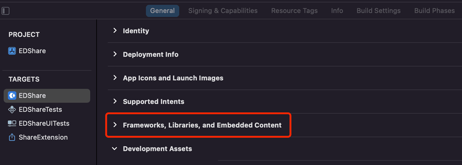

[TOC]

# w3fs network Objective-C/Swift language access instructions

The w3fs network provides its users with powerful and practical capabilities, including relevant technical capabilities in the blockchain field, unrestricted types of file encryption and decryption processing capabilities, and file decentralized storage capabilities. The collection of these technical capabilities can be applied to many real-world scenarios, such as in the field of NFT, which will enable NFT to carry out various forms of circulation without file type restrictions and no security risks under specific rules. You can also combine These capabilities create any form of Dapp you can imagine.
The following three technology integrations are described in detail in this document.
* Instructions for accessing the W3FS file encryption and decryption SDK.
* Code samples related to w3fs network access.
* w3fs network decentralized storage access instructions.

Developers or development teams can select targeted technologies to access according to their customized Dapps.


***


## W3FS-SDK iOS Access Instructions

### 1)、Usage Process


### 2)、Access to SDK

1. Drag TSKCrypto.xcframework directly into the project folder.

   

2. Since the SDK is wrapped in Objective-C, if the project is developed in Swift you need to create a bridge file and specify the read path to the bridge file. If the project is developed in Objective-C, skip this step and start from step 3.

   

   

3. Project setup：General > Targets > （eg：EDShare）> Frameworks, Libraries, and Embedded Contentm > Set Embed of TSKCrypto.xcframework to Embed & Sign 

   

   


4. Project setup：Build Settings > Search Paths > Specify library and header file search paths for the project

   

### 3)、Using the SDK (in Objective-C)

1. The SDK needs to be initialized once the program starts.

   ```objective-c
   -(BOOL)application:(UIApplication *)application didFinishLaunchingWithOptions:(NSDictionary *)launchOptions {
     // Override point for customization after application launch.
     TSKResult result = [[TSKSDK share] TSKInit];
     return YES;
   }
   ```

2. Reverse initialization of the SDK is required when the program is about to exit.

   ```objective-c
   -(void)applicationWillTerminate:(UIApplication *)application {
   	[[TSKSDK share] TSKUnInit];
   }
   ```

3. When a user logs out, he/she needs to clear his/her current identity.

   ```objective-c
   TSKResult result = [[TSKSDK share] setHoldIdentity:ListVerbClear KeyID:keyID permission:PermissionNone lastTime:-1 privateKey:nil privateKeyLength:0];
   result = [[TSKSDK share] logoutUser];
   ```

### 4)、Usage examples

1. File Encryption

   ```objective-c
   TSKResult result;
   TSKSDK *sdk = [TSKSDK share];
   NSString *srcPath = [[NSBundle mainBundle] pathForResource:@"origin" ofType:@"png"];
   NSString *cachesPath = NSSearchPathForDirectoriesInDomains(NSCachesDirectory, NSUserDomainMask, YES)[0];
   NSString *dstPath = [NSString stringWithFormat:@"%@/test.png",cachesPath];
   
   NSInteger taskID = [sdk fileOperateInit:FileOperateEncrypt threadCount:NSProcessInfo.processInfo.processorCount/2+1];
   result = [sdk addFileToTask:taskID fromPath:srcPath toPath:dstPath];
   result = [sdk startFileTask:taskID];
   while (1) {
       FileTaskStateModel *model = [sdk getFileTaskState:taskID];
       if (model.taskState == FileTaskSuccessed) {
           break;
       }
       sleep(1);
   }
   FileTaskReportModel *model = [sdk getFileTaskReport:taskID type:FileReportFull];
       if (model.totalSuccess == 1) {
           NSLog(@"Encrypt Success");
       }else {
           NSLog(@"Encrypt Error State:%ld",(long)model.reportStates.firstObject.reportState);
       }
   
   [sdk fileOperateUnInit:taskID];
   ```

2. File Sharing

   ```objective-c
   NSString *shareKeyID = [sdk IdentityGetKeyIDByPublicKey:sharePubKey];
   NSInteger shareTaskID = [sdk fileOperateInit:FileOperateShare threadCount:NSProcessInfo.processInfo.processorCount/2+1];
   result = [sdk addFileToTask:shareTaskID fromPath:dstPath toPath:nil];
   result = [sdk addActionToTask:shareTaskID type:identityOperateAdd KeyID:shareKeyID permission:PermissionOnlyAdjust lastTime:-1 pubKey:sharePubKey pubKeyLength:sharePubKey.length];
   result = [sdk setShareSign:shareTaskID type:FileSignSet];
   result = [sdk startFileTask:shareTaskID];
   while (1) {
       FileTaskStateModel *model = [sdk getFileTaskState:shareTaskID];
       if (model.taskState == FileTaskSuccessed) {
           break;
       }
   
       sleep(1);
   }
   FileTaskReportModel *shareModel = [sdk getFileTaskReport:shareTaskID type:FileReportFull];
   if (shareModel.totalSuccess == 1) {
       NSLog(@"Share Success");
   }else {
       NSLog(@"Share Error State:%ld",(long)model.reportStates.firstObject.reportState);
   }
   
   [sdk fileOperateUnInit:shareTaskID];
   ```

3. File Decryption

   ```objective-c
   NSInteger taskID = [sdk fileOperateInit:FileOperateDecrypt threadCount:NSProcessInfo.processInfo.processorCount/2+1];
   result = [sdk addFileToTask:taskID fromPath:srcPath toPath:dstPath];
   result = [sdk startFileTask:taskID];
   while (1) {
       FileTaskStateModel *model = [sdk getFileTaskState:taskID];
       if (model.taskState == FileTaskSuccessed) {
           break;
       }
   
       sleep(1);
   
   }
   FileTaskReportModel *models = [sdk getFileTaskReport:taskID type:FileReportFull];
   if (models.totalSuccess == 1) {
       NSLog(@"Decrypt Success");
   }else {
       NSLog(@"Decrypt Error State:%ld",(long)model.reportStates.firstObject.reportState);
   }
   
   [sdk fileOperateUnInit:taskID];
   ```

   

### 5)、Data Structures

1. Enumeration Statements

   ```objective-c
   typedef NS_ENUM(int, TSKResult) {
       TSKResultSuccess = 0,            // success
       TSKResultNoDataHandled = 1,      // version not supported
       TSKResultCreateObject = 10,      // Success, create new object
       TSKResultOpenObject = 11,        // Success, open the object
       TSKResultOverrideObject = 12,    // Success, open the object and override the object
       TSKResultLengthError = -1,       // failure, length error
       TSKResultTimeOut = -2,           // Failure, timeout
       TSKResultOutOfLength = -3,       // failed, insufficient buffer length
       TSKResultCantConnectKernel = -10,// Failed, cannot connect to kernel
       TSKResultFileServing = -11,      // Failed, there is currently a file being served
       TSKResultMultiUser = -20,        // Failed, multiple login users
       TSKResultNoUser = -21,           // Failed, no logged in users
       TSKResultSyntaxError = -30,      // Failed, syntax error
       TSKResultCantFindObject = -31,   // Failed, the specified object could not be found
       TSKResultMultiObject = -32,      // Failed, multiple objects specified
       TSKResultMaybeFindObject = -33,  // Failed, cannot find the specified object at the moment (cannot be sure to find the specified object at the moment)
       TSKResultCommonLogic = -34,      // Failed, common logic error
       TSKResultCipherError = -40,      // failure, encryption algorithm error (usually no encryption algorithm)
       TSKResultCipherInnerError = -41, // Failure, internal error in encryption algorithm
       TSKResultPermissionDenied = -42, // Failed, insufficient permission
       TSKResultHeaderCrcError = -50,   // Failed, failed to process encryption header structure, CRC error
       TSKResultIdentitySealError = -51,// Failed, failed to process identity envelope
       TSKResultOther = -100            // failure, other error (usually a memory allocation error)
   };
   
   typedef NS_ENUM(unsigned short, PermissionType) {
       PermissionNone = 0,      // can't decrypt and can't distribute
       PermissionOnlyDecpypt,   // decryptable but not distributable
       PermissionOnlyAdjust,    // can't be decrypted but can be distributed
       PermissionBoth           // decryptable and distributable
   };
   
   typedef NS_ENUM(NSInteger, ListVerbType) {
       ListVerbDefault = 1, // set the default default behavior
       ListVerbClear,       // clear the list of matches
       ListVerbAdd,         // add a match
       ListVerbDelete       // Delete the matches
   };
   
   typedef NS_ENUM(NSInteger, FileOperateType) {
       FileOperateEncrypt = 1, // encrypt operation
       FileOperateDecrypt,     // decrypt operation
       FileOperateShare        // Distribute operation
   };
   
   typedef NS_ENUM(BOOL, identityOperateType) {
       identityOperateAdd = YES,  // add identity
       identityOperateDelete = NO // Delete identity
   };
   
   typedef NS_ENUM(NSInteger, FileSignType) {
       FileSignKeep = 0,// keep signature information
       FileSignSet,     // set the signature information
       FileSignClear    // Clear the signature information
   };
   
   typedef NS_ENUM(NSInteger, FileReportType) {
       FileReportLite = 1, // minimalist mode
       FileReportFull      // full mode
   };
   
   typedef NS_ENUM(NSInteger, FileTaskState) {
       FileTaskReady = 0,      // to be started
       FileTaskEstimateLength, // data processing in progress (estimating data length phase)
       FileTaskProcessingData, // data processing in progress (processing data phase)
       FileTaskSuccessed,      // data processing completed (all data processed successfully)
       FileTaskCancelled       // data processing completed (externally initiated cancellation)
   };
   
   typedef NS_ENUM(NSInteger, FileTaskReportState) {
       FileTaskReportDataFailed = -6,  // key area checksum error
       FileTaskReportVersionFailed,    // version not supported
       FileTaskReportPermissionFailed, // Permission verification failed
       FileTaskReportTSKFailed,        // TSK library return failed
       FileTaskReportFileCantServices, // Unable to serve the file
       FileTaskReportIgnore,           // Ignored
       FileTaskReportSuccess           // Success
   };
   ```

   

2. Data Models

   ```objective-c
   // Description of the encryption algorithm
   @interface CipherDescModel : NSObject
   @property (nonatomic , strong) NSData* tag;  // encryption algorithm identifier
   @property (nonatomic , copy) NSString* name; // the name of the encryption algorithm
   @property (nonatomic , copy) NSString* desc; // algorithm description information
   @end
   
   // details of the encryption algorithm
   @interface CipherInfoModel : NSObject
   @property (nonatomic , assign) NSInteger keyLength; // the length of the secret key required by the algorithm (byte calculation)
   @property (nonatomic , assign) NSInteger blockSize; // the group size required by the algorithm (byte calculation)
   @end
   
   // File task state
   @interface FileTaskStateModel : NSObject
   @property (nonatomic , assign) FileTaskState taskState; // state
   @property (nonatomic , assign) NSInteger totalLength;   // total length of data to be processed (in bytes)
   @property (nonatomic , assign) NSInteger currentLength; // length of currently processed data (in bytes)
   @end
   
   // File task description status information
   @interface FileTaskReportStateModel : NSObject
   @property (nonatomic , assign) FileOperateType operateType;     // file operation type
   @property (nonatomic , assign) FileTaskReportState reportState; // the result of the file operation
   @property (nonatomic , copy) NSString* srcPath; // source file full path information
   @property (nonatomic , copy) NSString* dstPath; // full path information for the target file
   @end
   
   // File task description
   @interface FileTaskReportModel : NSObject
   @property (nonatomic , assign) NSInteger totalCount;   // total number of files
   @property (nonatomic , assign) NSInteger totalSuccess; // number of files that succeeded
   @property (nonatomic , assign) NSInteger totalFailed;  // number of failed files
   @property (nonatomic , assign) NSInteger totalIgnore;  // number of files ignored
   @property (nonatomic , copy, nullable) NSArray<FileTaskReportStateModel *>* reportStates; // detailed report for each file
   @end
   ```

   

3. Parameter Callback

   ```objective-c
   /// Identity issuance
   /// @param PubKey Public key
   /// @param PubKeyLen Public key length
   /// @param PrivateKey private key
   /// @param PrivateKeyLen private key length
   /// @param KeyID User ID
   typedef void(^ _Nullable identityIssueBlock)(NSData *PubKey, NSInteger PubKeyLen,NSData *PrivateKey, NSInteger PrivateKeyLen, NSString *KeyID);
   
   /// Summary callback
   /// @param result The data returned
   /// @param cookie The cookie needed for the iteration
   /// @param code The final result of the iteration summary
   typedef void(^ _Nullable digestBlock)(NSData * _Nullable result, NSInteger cookie,NSInteger code);
   ```

   

### 6)、Interface Description

1. Initialization

   ```objective-c
   /// @return Processing results
   /// TSKResultSuccess success
   /// TSKResultCantConnectKernel, failed, unable to connect to the W3FS file system kernel (only valid for Native ///dapp development).
   /// TSKResultOther, failed, other errors;
   - (TSKResult)TSKInit;
   ```

2. Reverse initialization

   ```objective-c
   /// Reverse initialization of W3FS-SDK Native library
   /// Dapp needs to call the TSK_UnInit interface to complete the reverse initialization of the W3FS Native SDK library when the program exits, so that the W3FS Native SDK library can clean up and release all occupied system resources.
   - (void)TSKUnInit;
   ```

3. Generate seed information

   ```objective-c
   /// The returned seed information will be used for user registration
   ///
   /// @param seedString The string used to generate the seed information
   /// @return seed information.It will be nil when error occurs
   - (nullable NSData *)makeSeed:(NSString *)seedString;
   ```

4. User Registration

   ```objective-c
   /// Generate (issue) an identity object. based on seed information
   ///
   /// @param seedData The seed information of the specified identity key information
   /// @param block Result callback
   /// @return Processing result
   /// TSKResultSuccess, success
   /// TSKResultOther, failed, other errors
   - (TSKResult)identityIssue:(NSData *)seedData block:(identityIssueBlock)block;
   ```

5. User Login

   ```objective-c
   /// You must be logged in before using the SDK encryption and decryption methods
   ///
   /// @param KeyID the corresponding internal ID representing the unique identity of the user
   /// @return Processing result
   /// TSKResultSuccess, success;
   /// TSKResultMultiUser, failed, there are other login users;
   /// TSKResultOther, other errors, usually memory allocation errors (or insufficient buffers);
   - (TSKResult)loginUser:(NSString *)KeyID;
   ```

6. User logout

   ```objective-c
   /// If you need to switch users or not use the SDK, you need to log out the current user
   ///
   /// @return processing result
   /// TSKResultSuccess, success;
   - (TSKResult)logoutUser;
   ```

7. CRC32 digest algorithm

   ```objective-c
   /// Iterative support for CRC32 digests of multiple streams
   ///
   /// @param data Specifies the stream to compute the CRC32 digest
   /// @param cookie Specifies the cookie needed for the iteration
   /// @param block Result callback
   /// @return processing result
   /// TSKResultSuccess, success
   /// TSKResultOther, failed, other errors
   /// 
   /// Usage: 1. Start summary, get cookie
   /// __block NSInteger crc32Cookie;
   /// TSKResult result = [[TSKSDK share] digestCRC32:nil cookie:0 block:^(NSData * _Nullable result, NSInteger cookie, NSInteger code) {
   /// crc32Cookie = cookie;
   /// }];
   /// 2. Perform the digest. The incoming cookie is fetched from the first step. If there are multiple streams, repeat the call
   /// NSData *data = [@"test" dataUsingEncoding:NSUTF8StringEncoding];
   /// result = [[TSKSDK share] digestCRC32:data cookie:crc32Cookie block:nil];
   /// 3. End summary. The incoming cookie is obtained from the first step. crc32Code is the digest result
   /// __block NSInteger crc32Code;
   /// TSKResult result = [[TSKSDK share] digestCRC32:nil cookie:crc32Cookie block:^(NSData * _Nullable result, NSInteger cookie, NSInteger code) {
   ///    crc32Code = code;
   /// }];
   - (TSKResult)digestCRC32:(nullable NSData *)data cookie:(NSInteger)cookie block:(digestBlock)block;
   ```

8. Single CRC32 digest algorithm

   ```objective-c
   /// @param data Specify the stream to calculate the CRC32 digest
   /// @param block Result callback
   /// @return processing result
   /// TSKResultSuccess, success
   /// TSKResultOther, failed, other errors
   ///
   /// Usage: Call the method, crc32Code is the summary result
   /// NSData *data = [@"test" dataUsingEncoding:NSUTF8StringEncoding];
   /// __block NSInteger crc32Code;
   /// TSKResult result = [[TSKSDK share] singleDigestCRC32:data block:^(NSData * _Nullable result, NSInteger cookie, NSInteger code) {
   ///     crc32Code = code;
   /// }];
   - (TSKResult)singleDigestCRC32:(nonnull NSData *)data block:(digestBlock)block;
   ```

9. MD5 digest algorithm

   ```objective-c
   /// Iterative support for MD5 algorithm digests over multiple streams
   /// 
   /// @param data Specifies the stream to compute the MD5 digest
   /// @param cookie Specifies the cookie needed for the iteration
   /// @param block Result callback
   /// @return Processing result
   /// TSKResultSuccess, success
   /// TSKResultOther, failed, other errors
   /// 
   /// Usage: 1. Start digest, get cookie
   /// __block NSInteger md5Cookie;
   /// TSKResult result = [[TSKSDK share] digestMD5:nil cookie:0 block:^(NSData * _Nullable result, NSInteger cookie, NSInteger code) {
   /// md5Cookie = cookie;
   /// }];
   /// 2. Perform the digest. The incoming cookie is fetched from the first step. If there are multiple streams, repeat the call
   /// NSData *data = [@"test" dataUsingEncoding:NSUTF8StringEncoding];
   /// result = [[TSKSDK share] digestMD5:data cookie:md5Cookie block:nil];
   /// 3. End summary. The incoming cookie is obtained from the first step. md5Data is the digest result
   /// __block NSData md5Data;
   /// TSKResult result = [[TSKSDK share] digestMD5:nil cookie:md5Cookie block:^(NSData * _Nullable result, NSInteger cookie, NSInteger code) {
   ///    md5Data = result;
   /// }];
   - (TSKResult)digestMD5:(nullable NSData *)data cookie:(NSInteger)cookie block:(digestBlock)block;
   ```

10. Single MD5 digest algorithm

    ```objective-c
    /// @param data Specify the stream to calculate the MD5 digest
    /// @param block Result callback
    /// @return processing result
    /// TSKResultSuccess, success
    /// TSKResultOther, failed, other errors
    ///
    /// Usage: Call the method, md5Data is the summary result
    /// NSData *data = [@"test" dataUsingEncoding:NSUTF8StringEncoding];
    /// __block NSData md5Data;
    /// TSKResult result = [[TSKSDK share] singleDigestMD5:data block:^(NSData * _Nullable result, NSInteger cookie, NSInteger code) {
    ///     md5Data = result;
    /// }];
    - (TSKResult)singleDigestMD5:(nonnull NSData *)data block:(digestBlock)block;
    ```

11. Sha256 digest algorithm

    ```objective-c
    /// Iterative support for SHA256 algorithm digests over multiple streams
    /// 
    /// @param data Specifies the stream to compute the Sha256 digest
    /// @param cookie Specifies the cookie needed for the iteration
    /// @param block Result callback
    /// @return Processing results
    /// TSKResultSuccess, success
    /// TSKResultOther, failed, other errors
    ///
    /// Usage: 1. Start digest, get cookie
    /// __block NSInteger sha256Cookie;
    /// TSKResult result = [[TSKSDK share] digestSha256:nil cookie:0 block:^(NSData * _Nullable result, NSInteger cookie, NSInteger code) {
    /// sha256Cookie = cookie;
    /// }];
    /// 2. Perform the digest. The incoming cookie is fetched from the first step. If there are multiple streams, repeat the call
    /// NSData *data = [@"test" dataUsingEncoding:NSUTF8StringEncoding];
    /// result = [[TSKSDK share] digestSha256:data cookie:sha256Cookie block:nil];
    /// 3. End summary. The incoming cookie is obtained from the first step. sha256Data is the digest result
    /// __block NSData sha256Data;
    /// TSKResult result = [[TSKSDK share] digestSha256:nil cookie:sha256Cookie block:^(NSData * _Nullable result, NSInteger cookie, NSInteger code) {
    ///    sha256Data = result;
    /// }];
    - (TSKResult)digestSha256:(nullable NSData *)data cookie:(NSInteger)cookie block:(digestBlock)block;
    ```

12. Single Sha256 digest algorithm

    ```objective-c
    /// @param data Specify the stream to calculate the Sha256 digest
    /// @param block Result callback
    /// @return Processing result
    /// TSKResultSuccess, success
    /// TSKResultOther, failed, other errors
    ///
    /// Usage: Call the method, sha256Data is the summary result
    /// NSData *data = [@"test" dataUsingEncoding:NSUTF8StringEncoding];
    /// __block NSData sha256Data;
    /// TSKResult result = [[TSKSDK share] singleDigestMD5:data block:^(NSData * _Nullable result, NSInteger cookie, NSInteger code) {
    ///     sha256Data = result;
    /// }];
    - (TSKResult)singleDigestSha256:(nonnull NSData *)data block:(digestBlock)block;
    ```

13. Get the description of all currently loaded algorithms

    ```objective-c
    /// @return Description of the algorithm
    - (nonnull NSArray<CipherDescModel *>*)GetCipherDesc;
    ```

14. Get the specified algorithm description

    ```objective-c
    /// @param cipherTag The identifier of the algorithm to be queried, for the tag variable of the CipherDescModel
    /// @return Information about the specified algorithm.It will be nil when error occurs
    - (nullable CipherInfoModel *)GetCipherInfo:(nonnull NSData *)cipherTag;
    ```

15. Set the default symmetric encryption algorithm

    ```objective-c
    /// Subsequent encryption and decryption will be performed using the set algorithm
    /// Non-essential function, if the method is not called, the default algorithm will be used for encryption and decryption
    ///
    /// @param cipherTag The identifier of the algorithm to be set, which is the tag variable of the CipherDescModel
    /// @return the result of processing
    /// TSKResultSuccess, success
    /// TSKResultCipherError, failed, the algorithm could not be found;
    /// TSKResultOther, other errors, usually memory allocation errors (or insufficient buffers);
    - (TSKResult)setDefaultCipher:(nonnull NSData *)cipherTag;
    ```

16. Set TSK file encryption paragraph encryption information

    ```objective-c
    /// The default encrypted paragraphs are fixed from the file header to the specified size of the file paragraphs.
    /// The paragraph size is 0, which is effectively the same as unencrypted; the paragraph size is -1, which is effectively the same as encrypting the entire file.
    /// Non-essential function, if this method is not called, the default length is used for encryption and decryption.
    /// @param zone The size (byte count) of the default encrypted paragraph to set
    /// @return the result of processing
    /// TSKResultSuccess, success
    /// TSKResultOther, other errors, usually memory allocation errors (or insufficient buffers);
    - (TSKResult)setDefaultZone:(NSInteger)zone;
    ```

17. Set the identity held by the current user of the library store

    ```objective-c
    /// @param type Operation type
    /// @param KeyID User ID
    /// @param permission Permissions
    /// @param lastTime File usage period
    /// @param privateKey private key
    /// @param privateKeyLength private key length
    /// @return Processing result
    /// TSKResultSuccess, success
    /// TSKResultNoUser, failed, there is no currently logged in user;
    /// TSKResultSyntaxError, failure, syntax error (such as unsupported verb, etc.);
    /// TSKResultMultiObject, failure, semantic error, the Key already exists (the identity ID already exists);
    /// TSKResultCantFindObject, failure, semantic error, delete the key that does not exist (the identity ID does not exist);
    /// TSKResultOther, other errors, usually memory allocation errors (or insufficient buffers);
    ///
    /// Usage: set current identity (own permission to decrypt and distribute, unlimited file lifetime)
    /// TSKResult result = [[TSKSDK share] setHoldIdentity:ListVerbAdd KeyID:address permission:PermissionBoth lastTime:-1 privateKey:priKey privateKeyLength:priKeyLen];
    /// Set the current identity as the default identity
    /// result = [[TSKSDK share] setHoldIdentity:ListVerbDefault KeyID:address permission:PermissionNone lastTime:0 privateKey:nil privateKeyLength:0];
    /// Clear all identities
    /// result = [[TSKSDK share] setHoldIdentity:ListVerbClear KeyID:@"" permission:PermissionNone lastTime:0 privateKey:nil privateKeyLength:0];
    - (TSKResult)setHoldIdentity:(ListVerbType)type KeyID:(NSString *)KeyID permission:(PermissionType)permission lastTime:(NSInteger)lastTime privateKey:(nullable NSData *)privateKey privateKeyLength:(NSInteger)privateKeyLength;
    ```

18. Initialize a file manipulation task

    ```objective-c
    /// All subsequent operations and control of file manipulation tasks are performed by the returned task ID
    ///
    /// @param type The type of operation
    /// @param threadCount The maximum number of threads recommended to balance performance and user experience is (cpu cores/2+1)
    /// @return Less than 0 indicates that the initialization of the file operation task failed, and no subsequent operations are required. Greater than or equal to 0 indicates that the initialization was successful, and the task ID corresponding to the file operation task is returned. All subsequent operations and control of the file operation task are performed through the task ID.
    - (NSInteger)fileOperateInit:(FileOperateType)type threadCount:(NSInteger)threadCount;
    ```

19. Add a full path of the file/folder to be manipulated to the specified file manipulation task

    ```objective-c
    /// Can be called multiple times to work on multiple files/folders at the same time during a single file operation task
    /// Only valid before the operation task is started, after the operation task is started, it cannot be added again
    /// The source file and the target file must be different paths, and the source file must be real.
    ///
    /// @param taskID file operation task ID
    /// @param fromPath Source file path
    /// @param toPath Target file path
    /// @return result
    /// TSKResultSuccess, success
    /// Others are failures
    - (TSKResult)addFileToTask:(NSInteger)taskID fromPath:(NSString *)fromPath toPath:(nullable NSString *)toPath;
    ```

20. Add a pending identity item action to the specified file operation task

    ```objective-c
    /// This method is only valid for file distribution
    /// Can be called multiple times to complete the distribution operation in the order it is called
    ///
    /// @param taskID File operation task ID
    /// @param type identity operation type
    /// @param KeyID User ID
    /// @param permission Permission
    /// @param lastTime File usage period
    /// @param pubKey public key
    /// @param pubKeyLength public key length
    /// @return Processing result
    /// TSKResultSuccess, success
    /// Others are failures
    - (TSKResult)addActionToTask:(NSInteger)taskID type:(identityOperateType)type KeyID:(NSString *)KeyID permission:(PermissionType)permission lastTime:(NSInteger)lastTime pubKey:(nullable NSData *)pubKey pubKeyLength:(NSInteger)pubKeyLength;
    ```

21. Set file operation task signature action

    ```objective-c
    /// This method is only valid for document distribution
    ///
    /// @param taskID File operation task ID
    /// @param type Signature action information
    /// @return Processing result
    /// TSKResultSuccess, success
    /// Others are failures
    - (TSKResult)setShareSign:(NSInteger)taskID type:(FileSignType)type;
    ```

22. Open file manipulation task

    ```objective-c
    /// After the file operation task is started, the Set Parameters interface cannot be called again to modify the properties of the file operation task
    ///
    /// @param taskID File operation task ID
    /// @return Processing result
    /// TSKResultSuccess, success
    /// Others are failures
    - (TSKResult)startFileTask:(NSInteger)taskID;
    ```

23. Aborting file manipulation tasks

    ```objective-c
    /// The file operation task is an asynchronous multi-threaded operation, the return value only returns whether the interface call is successful, the final result of the task cancellation to obtain the file operation task status interface call results shall prevail
    /// After the file operation task is canceled, it cannot be opened again, and the delete file operation task interface should be called subsequently
    /// The file operation task is cancelled, the file status of the completed operation will not be rolled back
    ///
    /// @param taskID File operation task ID
    /// @return processing result
    /// TSKResultSuccess, success
    /// Others are failures
    - (TSKResult)cancelFileTask:(NSInteger)taskID;
    ```

24. Delete file operation task

    ```objective-c
    /// After a file operation task is completed, regardless of the result, this method should be called to release the various system resources occupied by the file operation task
    /// A task whose status is predicted and in progress is not allowed to be deleted, and must wait for completion, or be actively canceled before being allowed to be deleted
    ///
    /// @param taskID File operation task ID
    /// @return Processing result
    /// TSKResultSuccess, success
    /// Others are failures
    - (TSKResult)fileOperateUnInit:(NSInteger)taskID;
    ```

25. Get the status of a file operation task

    ```objective-c
    /// The task state success does not mean the file processing is successful, the file processing result should be called to get the file operation task result report to get
    /// The returned task state taskState is FileTaskReady to be started, totalLength,currentLength data is invalid
    /// FileTaskEstimateLength data processing in progress (estimated data length stage), totalLength,currentLength data is invalid
    /// FileTaskProcessingData Data processing in progress (processing data phase), can use totalLength,currentLength to convert the percentage, or directly display the data length
    /// FileTaskSuccessed Data processing completed (all data processed successfully), totalLength,currentLength data invalid
    /// FileTaskCancelled data processing completed (external initiative to cancel), totalLength,currentLength data invalid
    /// 
    /// @param taskID File operation task ID
    /// @return Task status information.It will be nil when error occurs
    - (nullable FileTaskStateModel *)getFileTaskState:(NSInteger)taskID;
    ```

26. Get a report on the final results of the document manipulation task

    ```objective-c
    /// @param taskID File operation task ID
    /// @param type result report mode return reportStates only if set to FileReportFull
    /// @return result report.It will be nil when error occurs
    - (nullable FileTaskReportModel *)getFileTaskReport:(NSInteger)taskID type:(FileReportType)type;
    ```

27. Get all identity information in the eseal area of the specified file

    ```objective-c
    /// @param path Full path to the file
    /// @return All user IDs contained in the file.It will be nil when error occurs
    - (nullable NSArray<NSString *>*)GetESealInfoByPath:(NSString *)path;
    ```

28. Get the user ID from the public key

    ```objective-c
    /// @param pubKeyData public key
    /// @return userID.It will be nil when error occurs
    - (nullable NSString *)identityGetKeyIDByPublicKey:(NSData *)pubKeyData;
    ```

29. Get the public key from the private key

    ```objective-c
    /// @param privateKeyData private key
    /// @return public key.It will be nil when error occurs
    - (nullable NSString *)identityGetPublicKeyByPrivateKey:(NSData *)privateKeyData;
    ```

30. Whether the file manipulation task module is exitable

    ```objective-c
    /// If a file operation task is being processed, it is not allowed to exit and must wait until all tasks are completed or actively cancelled before it is allowed to exit
    ///
    /// @return whether exit is allowed
    - (BOOL)checkFileTaskCanExit;
    ```

31. Enable local Http service

    ```objective-c
    /// @param port Port number
    /// @return The result of the operation
    - (TSKResult)startLocalHttpServer:(NSInteger)port;
    ```

32. Stop local Http service

    ```objective-c
    - (void)stopLocalHttpServer;
    ```

33. Set local Http service time

    ```objective-c
    /// @param time Timestamp
    - (void)setTimeForLocalHttpServer:(NSInteger)time;
    ```

34. Obtain authentication key

    ```objective-c
    /// If using local services, the current authentication key must be obtained, and requests to local services must carry the obtained key to determine whether the request is valid
    /// 
    /// @return Authentication key
    - (NSString *)getKeyFromLocalHttpServer;
    ```

35. Set the basic parameters of the current website

    ```objective-c
    /// Download and open the DApp website data locally to provide a faster start-up and usage experience for DApp
    /// Currently only support dApp static data acquisition, and dynamic request forwarding
    ///
    /// @param fullPath The full path to the site's root directory
    /// @param dynamicFlag Dynamic request flag
    /// @param remoteServer Address of the remote server to which dynamic requests are forwarded
    /// @param homepageName Home page name, default is index.html
    /// @param pemPath The server's SSL public key is provided in the form of a standard pem certificate file
    - (void)setCurrentWebSiteParamForLocalHttpServer:(nullable NSString *)fullPath dynamicFlag:(nullable NSString *)dynamicFlag remoteServer:(nullable NSString *)remoteServer homepageName:(nullable NSString *)homepageName pemPath:(nullable NSString *)pemPath;
    ```

36. Get the raw data of the encrypted message header

    ```objective-c
    /// @param path The full path to the file
    /// @return raw data of encrypted message header
    - (NSData *)getOriginHeader:(NSString *)path;
    ```

37. Get the encrypted message header after padding

    ```objective-c
    /// The output file size is a multiple of 8K
    ///
    /// @param headerData pre-populated data
    /// @param toPath The full path to the output file
    /// @return processing result
    - (TSKResult)getFilledHeader:(NSData *)headerData toPath:(NSString *)toPath;
    ```

38. Get the original length of the encrypted message header

    ```objective-c
    /// @param path The full path to the file
    /// @return original length of encrypted message header (i.e. not including padding)
    - (NSInteger)getHeaderCount:(NSString *)path;
    ```

39. Determine if a file has been encrypted using the SDK based on the path

    ```objective-c
    /// @param path Full path to the file
    /// @return if the file is encrypted
    - (BOOL)isFileEncrypted:(NSString *)path;
    ```

40. Get the length of the padding area of the encrypted message header

    ```objective-c
    /// @param path file path
    /// @return length of padding area of encrypted message header
    - (NSInteger)getEncryptHeadFillLen:(NSString *)path;
    ```

41. Get the actual content length of the encrypted message header

    ```objective-c
    /// @param path file path
    /// @return The actual length of the encrypted message header
    - (NSInteger)getEncryptHeadLen:(NSString *)path;
    ```

***


## w3fs network transaction related access example (iOS-Swift)

### 1.foreword

The purpose of this document is to help the development team understand the process and implementation methods related to w3fs's interaction with the chain. This document uses the Swift code on the iOS platform to use the Ethereum Web3 library as an example to introduce the implementation of functions related to accounts, assets, transactions, and smart contract calls.

### 2.resource reference

Xcode creates a Swift project, click Project->Package Dependsdencies, click the plus sign->enter URL: https://github.com/DecryptMedia/EthereumKitSPM, click Add Package to add EthereumKit. Click the plus sign again -> enter the URL: https://github.com/Boilertalk/Web3.swift, click Add Package to add Web3. Click the plus sign again -> enter the URL: https://github.com/mxcl/PromiseKit, click Add Package to add PromiseKit

### 3.Process introduction

**1.Account related**


**2.Transaction related**


### 4.Related function code example

**1.Account related**
Account information includes private key, public key, address, and create related objects:

```swift
let privateKey : PrivateKey 
let publicKey : PublicKey 
let address : String  
```

* 1.1 generate mnemonic
  The mnemonic is generated by randomly selecting 12 permutations of specific 1024 English words. It is an important means of generating an account. The code for generating the mnemonic is as follows：

```swift
let mnemonic = NWMnemonic.createMnemonic()
```

* 1.2 Generate account by mnemonic
  One mnemonic can generate N wallet accounts, and the specified account can be generated by specifying the index. code show as below：

```swift
let seed = try? Mnemonic.createSeed(mnemonic: mnemonic, withPassphrase: "")

guard seed != nil && isValid(phrase: mnemonic) else {
  NWToast.show(text: "validation error, please re-enter")
  return ("","","")
}

_ = try! Wallet(seed: seed!, network: .mainnet, debugPrints: true)
let hdWallet = HDWallet(seed: seed!, network: .mainnet)
let privateKey = try! hdWallet.privateKey(at: index)
let publicKey = priKey.publicKey
let address = pubKey.address()
```

* 1.3 Generate account with private key
* When you have generated a wallet account, you can obtain the relevant information of the account corresponding to the private key through the private key of the account.
  code show as below:

```swift
let wallet = Wallet(network: .mainnet, privateKey: priKey, debugPrints: true)
let privateKey = wallet.privateKey()
let publicKey = wallet.publicKey()
let address = wallet.address()
```

**2.Transaction related**
parameter configuration

| noun                  | Paraphrase                   |
| --------------------- | ---------------------------- |
| k_rpcUrl              | the domain name of the chain |
| k_chainIdchainId      |                              |
| k_fileStorageContract | contract address             |

* 2.1 View ABI Documentation
  Through the ABI document, you can view the name of the contract method, input parameters and return parameters. This document takes balance query and transfer as an example. The ABI document is as follows:

```
[{"inputs":[{"internalType":"address","name":"account","type":"address"}],"name":"balanceOf","outputs":[{"internalType":"uint256","name":"","type":"uint256"}],"stateMutability":"view","type":"function"},
{"inputs":[{"internalType":"address","name":"to","type":"address"},{"internalType":"uint256","name":"amount","type":"uint256"}],"name":"transfer","outputs":[{"internalType":"bool","name":"","type":"bool"}],"stateMutability":"nonpayable","type":"function"}]
```

* 2.2 Check balances

Web3.jsFor all query interfaces, you can view related documents of Web3.js.
Contract query You can query related information, such as token balance, token name, token symbol, etc., through the contract method without consuming gas.

```swift
typealias RequestResultBlock = (String) -> ()

func getBalance(isw3fs: Bool, userAddress: String, contractAddress: String? = nil, successBlock:@escaping RequestResultBlock, failBlock: RequestResultBlock? = nil) {
        if isw3fs {
            firstly { () -> Promise<EthereumQuantity> in
                let accountAddress = try EthereumAddress(hex: userAddress.addPrefix(), eip55: true)
                return web3.eth.getBalance(address: accountAddress, block: .latest)
            }.done { response in
                successBlock(String(response.quantity))
            }.catch { [self] error in
                failBlock?(errorString(error))
            }
        }else if let contractAddress = contractAddress {
            firstly { () -> Promise<[String : Any]> in
                let user = try EthereumAddress(hex: userAddress.addPrefix(), eip55: true)
                let contract = try EthereumAddress(hex: contractAddress.addPrefix(), eip55: true)
                let ERC20Contract = web3.eth.Contract(type: GenericERC20Contract.self, address: contract)
                return ERC20Contract.balanceOf(address: user).call()
            }.done { outputs in
                let balance = outputs["_balance"] as? BigUInt
                if let balance = balance {
                    successBlock(String(balance))
                }else {
                    failBlock?("Can't Get Balance")
                }
            }.catch { [self] error in
                failBlock?(errorString(error))
            }
        }else {
            failBlock?("Can't Get ContractAddress")
        }
    }
```

* 2.3 transaction
  Before formally initiating a contract transaction, you need to obtain the minimum gas to be paid for the transaction according to the transaction parameters. Through the contract ABI, you can learn that the transfer method is called transfer, the input parameters are to and amount, the types are address and uint256 respectively, and the output parameter is bool , the implementation code is as follows The code for obtaining gas is as follows:

```swift
typealias SignedTransactionResultBlock = (EthereumSignedTransaction) -> ()


func getTransferEstimateGas(isw3fs: Bool, fromAddress: String?, toAddress: String, value: BigUInt, successBlock:@escaping RequestResultBlock, failBlock: RequestResultBlock? = nil) {

        do {
            let to = try EthereumAddress(hex: toAddress.addPrefix(), eip55: true)
            if isw3fs {
                let value = EthereumQuantity(quantity: value)
                let call = EthereumCall(from: accountAddress, to: to, value: value)
                firstly {
                    web3.eth.estimateGas(call: call)
                }.done({ result in
                    successBlock(String(result.quantity))
                }).catch { [self] error in
                    failBlock?(errorString(error))
                }
            }else if let fromAddress = fromAddress {
                let contractAddress = try EthereumAddress(hex: fromAddress.addPrefix(), eip55: true)
                let ERC20Contract = web3.eth.Contract(type: GenericERC20Contract.self, address: contractAddress)
                ERC20Contract.transfer(to: to, value: value).estimateGas(from: accountAddress) { [self] result, error in
                    if let error = error { failBlock?(errorString(error)) }
                    else { successBlock(String(result!.quantity)) }
                }
            }else {
                failBlock?("Can't get gas")
            }
        } catch {
            failBlock?(errorString(error))
        }
    }

//signed transaction
func signTransfer(isw3fs: Bool = true, contractAddress: String? = nil, toAddress: String, gasPrice:BigUInt, gasLimit:BigUInt, value:BigUInt, successBlock:@escaping SignedTransactionResultBlock, failBlock: RequestResultBlock? = nil) {
        
        if isw3fs {
            firstly {
                web3.eth.getTransactionCount(address: privateKey!.address, block: .pending)
            }.then { [self] nonce -> Promise<EthereumSignedTransaction> in
                let address = try EthereumAddress(hex: toAddress.addPrefix(), eip55: true)
                let setTran = EthereumTransaction(nonce: nonce, gasPrice: EthereumQuantity(quantity: gasPrice), gas: EthereumQuantity(quantity: gasLimit), from: accountAddress!, to: address, value: EthereumQuantity(quantity: value))
                return try setTran.sign(with: privateKey!, chainId: chainId).promise
            }.done { tx in
                successBlock(tx)
            }.catch { [self] error in
                failBlock?(errorString(error))
            }
        }else if let contractAddress = contractAddress {
            firstly {
                web3.eth.getTransactionCount(address: privateKey!.address, block: .pending)
            }.then { [self] nonce -> Promise<EthereumSignedTransaction> in
                let contract = try EthereumAddress(hex: contractAddress.addPrefix(), eip55: true)
                let ERC20Contract = web3.eth.Contract(type: GenericERC20Contract.self, address: contract)
                let to = try EthereumAddress(hex: toAddress.addPrefix(), eip55: true)
                let setTran = ERC20Contract.transfer(to: to, value: value).createTransaction(nonce: nonce, from: accountAddress!, value: 0, gas: EthereumQuantity(quantity: gasLimit), gasPrice: EthereumQuantity(quantity: gasPrice))
                return try setTran!.sign(with: privateKey!, chainId: chainId).promise
            }.done { tx in
                successBlock(tx)
            }.catch { [self] error in
                failBlock?(errorString(error))
            }
        }else {
            failBlock?("Can't transfer")
        }
    }

//send transaction
func sendRawTransaction(_ signedTransaction: EthereumSignedTransaction, successBlock:@escaping RequestSetSuccessBlock, failBlock: RequestResultBlock? = nil) {
        firstly {
            web3.eth.sendRawTransaction(transaction: signedTransaction)
        }.done { hash in
            successBlock()
        }.catch { [self] error in
            let errorString = errorString(error)
            failBlock?(errorString)
        }
    }

```

* 2.4 View transaction status

```swift
typealias ReceiptTransactionBlock = (_ receipt: EthereumTransactionReceiptObject?, _ error: String?) -> ()


func getHashFromTransaction(_ transaction: EthereumSignedTransaction) -> String {
        return "0x" + (try! RLPEncoder().encode(transaction.rlp())).sha3(.keccak256).toHexString()
    }


   func getReceiptFromTransactionHash(_ hash: String, successBlock: @escaping ReceiptTransactionBlock, failBlock: @escaping ReceiptTransactionBlock) {
        
        let hashValue = EthereumValue(stringLiteral: hash.stripHexPrefix())
        firstly {
            web3.eth.getTransactionReceipt(transactionHash: try EthereumData(ethereumValue: hashValue))
        }.done { receipt in
            if let receipt = receipt {
                if receipt.logs.count >= 2 && receipt.status == EthereumQuantity(integerLiteral: 1) {
                    successBlock(receipt, nil)
                } else  {
                    failBlock(receipt, "transaction failed")
                }
            } else {
                failBlock(nil, "transaction receipt is nil")
            }
        }.catch { [self] error in
            failBlock(nil, errorString(error))
        }
    }
```


***


## w3fs decentralized storage development documentation

### 1. Background introduction

As an important module of the w3fs network, w3fs decentralized storage is an efficient decentralized file storage system. It is technically combined with the DSCAN (proxy cdn) technology system to further improve the efficiency of file storage and download. His launch has greatly lowered the threshold for the use of decentralized storage, allowing everyone to easily get started and have an excellent user experience. The purpose of this document is to introduce to developers or development teams how to integrate and use w3fs network decentralized storage related services.

The following will explain in detail how to integrate the relevant functions of the decentralized storage of the w3fs network (please replace the example domain name (http://w3fsMainNet:8545) used in the following with the actual network of w3fs).

***

 

**Reading prerequisites**

* Have read the relevant documents of W3FS-SDK encryption and decryption.

* Familiar with web3js and smart contract function calls.

* Have read the code related to w3fs network transaction access.

* Understand the basic request and response messages of the http protocol.

* Understand the basic request and response messages of the RPC protocol.

 

***

### 2. Definition of nouns


| noun          | explain                                                      |
| ------------- | ------------------------------------------------------------ |
| Entire file   | When a file is stored, whether it is an encrypted file or not, it is uploaded and stored in the form of the entire file, which is called the entire file |
| Separate file | When the file is stored, first use the encryption interface in W3FS-SDK to encrypt the file, and then generate the file head and body, and upload and store the file separately, which is called separate file |
| oriHash       | Use the sha256 hash algorithm to calculate the 32-byte oriHash of the entire original file (unencrypted), starting with "0x", a total of 66 hexadecimal characters |
| storeKey      | The current user's account address (EOA) is spelled with oriHash (remove 0x) and the value obtained is called storeKey, which starts with "0x", a total of 106 hexadecimal characters |
| storeKeyHash  | Perform sha256 algorithm operation on storeKey again to get a 32-byte storeKeyHash, starting with "0x", a total of 66 hexadecimal characters |
| headHash      | The head (electronic envelope area) is encrypted and generated by W3FS-SDK, and the hash value obtained by the "SHA-256" digest algorithm of the head file starts with "0x", a total of 66 hexadecimal characters |
| bodyHash      | The hash value of the body part of the ciphertext encrypted by W3FS-SDK is obtained by the "SHA-256" digest algorithm, starting with "0x", a total of 66 hexadecimal characters |
| minerId       | Id of the storage node, starting with "0x", a total of 66 hexadecimal characters |
| fileExt       | File extension information                                   |
| fileSize      | File size                                                    |


 

***

 

### 3. Two usage scenarios of decentralized storage

In the decentralized storage file system of the w3fs network, two usage scenarios are designed in order to meet the needs of diversified users. 

1. Ordinary decentralized storage scenarios with data backup as the main purpose,Called **Entire File Storage**. 
2. The transaction scenario with the characteristics of file ownership and the security control of file permissions is called **separate file storage**. Users can choose which storage scenario to use according to their customized business needs.

It needs to be clear that the entire file and the separate file are two independent API implementations stored in the same decentralized storage file system, and the files stored in the two storage methods are unrelated to each other, that is to say,  a file file1 that has already stored the entire file in the storage node can also use the method of separate file to initiate storage again without being rejected in the same decentralized storage file system.

 

#### 3.1. Entire file storage ( ordinary decentralized storage scenario )

Like most decentralized storage, we offer to store a file directly into the w3fs network's decentralized storage file system. And before storage, according to different business requirements, the storage initiator can decide whether to encrypt and then store the file.

 

Before initiating the storage of a entire file, the following concepts need to be clarified:

* **address**: The EOA address of the user in the w3fs network, a 20-byte 16-mechanism string. For example: 0x687b5a626340EFfE324118F172092344Dd7FcB49.

* **oriHash**: Use the sha256 hash algorithm to calculate the 32-byte oriHash for the entire file to be stored (whether the file itself is encrypted or not). Such as: 0xe8452fc5541baa5c085455ba769cd163542cc491d05c721682153fde149bda22

* **storeKey**: Add oriHash to address (oriHash removes 0x during splicing) to get storeKey. For example: 0x687b5a626340EFfE324118F172092344Dd7FcB49e8452fc5541baa5c085455ba769cd163542cc491d05c721682153fde149bda22

* **storeKeyHash**: Perform the sha256 algorithm operation on the storeKey again to obtain a 32-byte storeKeyHash. For example: 0x5a31eb46ec62617cc4416746f14b7a777007441a477d1e87344a65ae35460c10

 

##### entire file storage core process

* a.**Calculation file storage information**

Dapp selects the file file1 to be stored (whether the file is encrypted or not), and calculates the oriHash, storeKey, and storeKeyHash of file1. And get the file size and file type of file1.

***

 

* b. **Select the target node for file storage**.

Call the json-rpc interface (w3fs_getMiners4Entire) provided by the decentralized storage to obtain the node list. Select a node as the storage destination node. It should be reminded that for the same file, when the entire file is used for storage, each node can only successfully store it once, unless the same file is stored on different nodes to achieve the purpose of multi-node backup.

```
curl -H "Content-Type:application/json" -X POST --data '{"jsonrpc":"2.0","method":"w3fs_getMiners4Entire","params":[{ "minerNum":4,"storeKey ":" 0x687b5a626340EFfE324118F172092344Dd7FcB49e8452fc5541baa5c085455ba769cd163542cc491d05c721682153fde149bda22 "}],"id":1}'

http://w3fsMainNet:8545

Parameter Description:
minerNum: Specifies the number of storage nodes returned.
storeKey: The storeKey is obtained by spelling the address with oriHash (oriHash without 0x) .
type: The returned node list type. stored (default), unstored, both.
 

Return data description:

{"jsonrpc":"2.0","id":1,"result":[{"minerId":"0x741e86df5954cab0ffa480085c18c1e23ab0958851caa89e5e38adad9bcf5f16","status":false,"publicKey":"304d03020700020120022100f863e92900a68cf033f253be61f80e188ecf41b3032544fd72c069995ec8d2b4022100e29346cfe14f1d7ba9e3685cf5e2d59c0cd75aba6f64ea533f1d62c7d9881eee","freeSpaceRatio":0.33}]}

Parameter Description:

minerId : Node Id.
status : Whether the file corresponding to the storeKey has a storage record on this node. In actual use, which nodes can be stored and which nodes have been stored can be selected according to the field value.
publicKey: The public key for encryption and decryption of the file corresponding to the node. (Required for separate file storage scenarios)
freeSpaceRatio: The free space ratio. (The ratio of the free storage space of each node in the returned list)

Absenteeism selection recommendation algorithm: the value of freeSpaceRatio in the node list returned by the requester calling the interface is accumulated in sequence, and the value is 1. Dapp can generate a random number with a value of 0 to 1 locally, which is decremented in the order of the returned node list. Go to the freeSpaceRatio value of each node until the generated random number is less than or equal to 0, the current node is the hit storage node.
   

 

```

***

 

* c. **Call the storage contract to save the storage information**.

In order to ensure the purity of the decentralized storage environment, it is necessary to register the file information in the smart contract associated with the decentralized storage before initiating storage.

The called **storage smart contract address is fixed as: 0x000000000000000000000000000000000003002**. The contract function for file information registration is defined as follows:

```
To ensure the purity of the W3FS storage environment, a small amount of value and gas needs to be paid before storing files.First call the function in the following contract to obtain the cost of the file to be stored this time.

function getFileCost(
uint256 fileSize, //The size of the file
)

After calling this function,You can obtain a value of type Uint256 stored this time.

Contract file information registration function and related parameters,At the same time, you need to pay the value of the file store obtained in the previous step

function createFileStoreInfo4Entire(

bytes32 storeKeyHash, //storeKey is the 32-byte value calculated by sha256, starting with 0x

uint256 fileSize, //The size of the file

   string calldata fileExt, //type of file

bytes32 minerId //Selected storage node Id

)

The event emitted after the contract invocation is successful

event newFileStoreEvt(

bytes oriHash, // for the entire file: oriHash, for the separate file: storeKeyHash

address userAddr, // user address

uint256 fileSize, // fileSize

string fileExt,

bytes minerId, // minerId

bytes headHash, // headHash

bytes bodyHash, // bodyHash

uint256 operTime // operTime

);

```

Wait for the transaction to return to the logs log to make sure the message has been processed. If the registration is completed, proceed to the following steps. Otherwise continue to wait or exit. Storage requests that have not yet registered the file information in the storage contract will be rejected by the system.

***

 

* d. **Start file upload**

File upload can decide which upload method to use according to the size of the file to be uploaded. There are two ways of uploading small files and uploading large files in slices. Small files and large files are generally limited to 30M. Dapp can decide which upload method to use according to its own needs and scenarios.

For the specific upload implementation, please refer to the detailed introduction to file upload in Chapter 4.

***

 

* e. **call file storage**

After the file is uploaded, you can call the json-rpc interface (w3fs_clientSend4Entire) of the entire file storage to start the storage.

**Request data**

```
 curl -H "Content-Type:application/json" -X POST --data '{"jsonrpc":"2.0","method":"w3fs_clientSend4Entire","params":[{"storeKey":"0x211fA1DDbE3d000e1a42921eC56bBE7A923A6BeDe8452fc5541baa5c085455ba769cd163542cc491d05c721682153fde149bda22", "minerId":"0x0ffeb2e287089058b7b7e93284c8107cef04b3ac693e826233aa0c2b802a42a2","file":"0xe8452fc5541baa5c085455ba769cd163542cc491d05c721682153fde149bda22"}],"id":1}' http://w3fsMainNet:8545

```

| parameter name | type   | description                                                  |
| -------------- | ------ | ------------------------------------------------------------ |
| storeKey       | String | Hexadecimal string starting with 0x, a total of 106 characters, composed of user EOA address + oriHash (without 0x) |
| minerId        | string | hexadecimal string starting with 0x, a total of 66 characters, must be the same minerId provided when calling the storage contract to save the information |
| file           | String | The result of the sha256 algorithm calculation of the uploaded file, the hexadecimal string starting with 0x, a total of 66 characters |

**Return value description**

Status: 200- means the submission is successful, 500 means the submission fails, and the specific error information is given in the Message

 

 

***

 

* f. **Query file storage status**

After calling the file storage rpc interface and returning successfully, you need to query the storage status. Only the files that have been stored can be downloaded normally. It is recommended to poll the json-rpc interface (w3fs_getStorageStatus4Entire) for querying the storage status.

**Request data**

 

```
curl -H "Content-Type:application/json" -X POST --data '{"jsonrpc":"2.0","method":"w3fs_getStorageStatus4Entire","params":[{ "storeKey":"0x211fA1DDbE3d000e1a42921eC56bBE7A923A6BeDe8452fc5541baa5c085455ba769cd163542cc491d05c721682153fde149bda22", "minerId":"0x0ffeb2e287089058b7b7e93284c8107cef04b3ac693e826233aa0c2b802a42a2"}],"id":1}' http://w3fsMainNet:8545

```

| parameter name | type   | description                                                  |
| -------------- | ------ | ------------------------------------------------------------ |
| storeKey       | String | A hexadecimal string starting with 0x, a total of 106 characters, composed of user EOA address + oriHash (without 0x) |
| minerId        | string | A hexadecimal string starting with 0x, a total of 66 characters, must be the same as the minerId provided when calling the start storage |

**Return value description**

   

```
{"jsonrpc":"2.0","id":1,"result":{"Status":200,"Message":"success","Timestamp":"2022-03-28T05:51:11.711594603Z" }}

```

​      

 

Status: 0 means initial, 100 means being processed, 200- means submission is successful, 400 means timeout, 500 means storage failure, and Message gives specific error information.

In particular, if it is 200, it means that the storage is complete. If it is 100, when submitting clientSend with the same parameters again, the request will be ignored.

Status: 200- means the submission is successful, 500 means the submission fails, and the specific error information is given in the Message

 

***

 

##### Download process of the entire file

A file can be downloaded if it has been stored normally in the decentralized storage of the w3fs network and the storage status is completed. Downloads for w3fs Network Decentralized Storage are free. The download is divided into two steps: 1. Retrieve the file, 2. Download the file.

* **Call the retrieval json-rpc interface (w3fs_clientRetrieval4Entire) of the entire file to retrieve the file**.

**Request data**

```
curl -H "Content-Type:application/json" -X POST --data '{"jsonrpc":"2.0","method":"w3fs_clientRetrieval4Entire","params":[{ "storeKey":"0xcdd122382f79686f9a46c37a899f2a6c5ff119097ef938e3998f3a32a7774 ],"id":1}' http://w3fsMainNet:8545

```

| parameter name | type   | description                                                  |
| -------------- | ------ | ------------------------------------------------------------ |
| storeKey       | String | A hexadecimal string starting with 0x, a total of 106 characters, composed of user EOA address + oriHash (without 0x) |

 

**Return value description**

Status: 200- means the submission is successful, 500 means the submission fails, and the specific error information is given in the Message

       If 200 is returned, Message is a json string in the format of the example below.

```
{"jsonrpc":"2.0","id":1,"result":{"Status":200,"Message":"{\"FileExt\":\"txt\",\"FileSize\": 1234}","Timestamp":"2022-06-02T07:04:44.244707303Z"}}

```

**Query file retrieval status (w3fs_clientRetrieval4Status)**

**Request data**

```
curl -H "Content-Type:application/json" -X POST --data '{"jsonrpc":"2.0","method":"w3fs_clientRetrieval4Status","params":[{ "storeKey":"0xcdd122382f79686f9a46c37a899f2a6c5ff119097ef938e3998f3a32a774 ],"id":1}'

```

| parameter name | type   | description                                                  |
| -------------- | ------ | ------------------------------------------------------------ |
| storeKey       | String | A hexadecimal string starting with 0x, a total of 106 characters, composed of user EOA address + oriHash (without 0x) |

 

**Return value description**

Status: 0 means initial, 100 means being retrieved, 200- means successful submission, 400 means timeout, 500 means submission failure, and Message gives specific error information.

In particular, if it is 200, further downloads can be made. If it is 100, submitting clientRetrieval4Entire again will be ignored.

 

```
{"jsonrpc":"2.0","id":1,"result":{"Status":200,"Message":"","Timestamp":"2022-03-25T09:22:38.542321127Z"} }

```

 

 

 

***

  

* Start file download

If the file retrieval status returns Completed. You can start the download of the file. For the specific download implementation, please refer to the detailed introduction to the entire file download in Chapter 4.

 

 

***


#### 3.2 separate file storage

Different from the storage of the entire file, the separate file storage refers to the file storage type that conforms to the W3FS protocol specification. Its core is an encrypted file. In order to facilitate access control and distribution, the file is split into a file header and a file body, and the two files are uploaded, stored, retrieved, downloaded, and then spliced into a single file for use.

The separate file must be encrypted, and the encryption method provided by the W3FS protocol is required to generate the file head and the file body.

Separate file storage is suitable for some scenarios where Dapp needs to adjust the file authorization. The core of his operation is to call the authorization interface of W3FS-SDK before storing the file after the file is encrypted to grant the identity managed by Dapp the permission to operate the file. After the file is downloaded, the identity managed by Dapp has been granted modification before storage. Therefore, the file head can be dynamically adjusted, and finally assembled with the file body into a complete file with new identity information. The core purpose of this operation process is that when some uploaded separate files need to be authorized to modify the identity, there is no need to re-store a new complete encrypted file after adjusting the file permissions every time.

##### Separate file storage core process

**a. Encryption**. The dapp calls the encryption interface of W3FS-SDK (for the specific implementation, please refer to the W3FS-SDK access documentation) to encrypt the files to be stored and generate the file head and body. There is only one Owner authority by default in the head. The dapp side decides whether to add other identity accounts for adjusting the file head according to its own business needs, such as the identity managed by the central server or the identity of the storage node (which requires the auxiliary authorization of the decentralized storage system). The identity of the storage node can be added to the separate file). 

 

***

* **b. Select the target node for storage**.

Call the json-rpc interface (w3fs_getMiners) provided by the decentralized storage to obtain the node list. Select a node as the storage destination node. It should be reminded that the same file can be stored on different nodes multiple times, but a separate file in each node can only be successfully stored once.

```
curl -H "Content-Type:application/json" -X POST --data '{"jsonrpc":"2.0","method":"w3fs_getMiners","params":[{ "minerNum":50,"oriHash ":"0x687b5a626340EFfE324118F172092344Dd7FcB49e8452fc5541baa5c085455ba769cd163542cc491d05c721682153fde149bda22"}],"id":1}'

http://w3fsMainNet:8545

Parameter Description:
minerNum: Specifies the number of storage nodes returned.
oriHash: The hexadecimal string of the sha256 value of the plaintext of the file.
type: The returned node list type. stored (default), unstored, both.
 

Return data description:

{"jsonrpc":"2.0","id":1,"result":[{"minerId":"0x741e86df5954cab0ffa480085c18c1e23ab0958851caa89e5e38adad9bcf5f16","status":false,"publicKey":"304d03020700020120022100f863e92900a68cf033f253be61f80e188ecf41b3032544fd72c069995ec8d2b4022100e29346cfe14f1d7ba9e3685cf5e2d59c0cd75aba6f64ea533f1d62c7d9881eee","freeSpaceRatio":0.33}]}

 

Parameter Description:
minerId: Node Id.
status: Whether the file corresponding to the storeKey has a storage record on the node.
publicKey: The public key for encryption and decryption of the file corresponding to the node.
freeSpaceRatio: The free space ratio. (The ratio of the free storage space of each node in the returned list)

Absenteeism selection recommendation algorithm: the value of freeSpaceRatio in the node list returned by the requester calling the interface is accumulated in sequence, and the value is 1. Dapp can generate a random number with a value of 0 to 1 locally, which is decremented in the order of the returned node list. Go to the freeSpaceRatio value of each node until the generated random number is less than or equal to 0, the current node is the hit storage node.
 

```

 

***

* **c. Invoke the storage contract to save the storage related information of the separate file**.

Like the entire file storage, the information of the separate files needs to be registered in the storage smart contract before starting the storage. The smart contract registration function is defined as follows:

```
Separate file registration file information contract method and parameters

function createFileStoreInfo(

bytes32 oriHash,//The 32-byte hexadecimal string calculated by the sha256 algorithm of the plaintext state of the file

uint256 fileSize, //The size of the encrypted file. (total size of head and body)

string calldata fileExt,//type of file

bytes32 minerId,//Storage node Id

bytes32 headHash,//The 32-byte hexadecimal string calculated by the sha256 algorithm of the head part of the file

bytes32 bodyHash //The 32-byte hexadecimal string calculated by the sha256 algorithm of the body part of the file

)

The event emitted after the contract invocation is successful

event newFileStoreEvt(

bytes oriHash, // for the entire file: storeKeyHash, for the separate file: oriHash

address userAddr, // user address

uint256 fileSize, // fileSize

string fileExt,

bytes minerId, // minerId

bytes headHash, // headHash

bytes bodyHash, // bodyHash

uint256 operTime // operTime

);

```

Wait for the transaction to return to the logs log to make sure the message has been processed. If the registration is completed, proceed to the following steps. Otherwise continue to wait or exit.

 

***

* **d. upload files (head and body are uploaded separately)**.

When uploading a separate file, you need to divide it into two separate files, head and body, for uploading. File upload can decide which upload method to use according to the size of the file to be uploaded. There are two ways of uploading small files and uploading slices of large files. There are no fixed restrictions on the definition of small files and large files, and Dapp can decide which upload method to use according to its own special scenarios.

For the specific upload implementation, please refer to the detailed introduction to the separate file upload in Chapter 4.

***

* **e.store separate files (head and body are stored separately)**.

Like uploading, the storage of separate files also needs to be divided into two parts for storage calls.

**Request data**

```
curl -H "Content-Type:application/json" -X POST --data '{"jsonrpc":"2.0","method":"w3fs_clientSend","params":[{"oriHash":"0x211fA1DDbE3d000e1a42921eC56bBE7A923A6BeDe8452fc5541baa5c085455ba769cd163542cc491d05c721682153fde149bda22", "minerId":"0x0ffeb2e287089058b7b7e93284c8107cef04b3ac693e826233aa0c2b802a42a2","headFlag":true,"file":"0xe8452fc5541baa5c085455ba769cd163542cc491d05c721682153fde149bda22"}],"id":1}' http://w3fsMainNet:8545

```

| parameter name | type    | description                                                  |
| -------------- | ------- | ------------------------------------------------------------ |
| oriHash        | String  | A 32-byte hexadecimal string with a 0x prefix calculated by the sha256 algorithm of the source file, a total of 66 characters |
| minerId        | string  | A hexadecimal string starting with 0x, a total of 66 characters, must be the same minerId |
| headFlag       | boolean | Whether the uploaded file part is the file header            |
| file           | string  | A 32-byte hexadecimal string with a 0x prefix calculated by the sha256 digest algorithm for the head or body of the file, a total of 66 characters |

**Return value description**

Status: 200 means the submission is successful, 500 means the submission fails, and the specific error information is given in the Message

 

***

* **f. query file storage status**

After calling the storage rpc interface of the separate file and returning successfully, you need to query the storage status. Only the files that have been stored can be downloaded normally. Don't remind me that the retrieval of a separate file also requires two file parts to be retrieved separately. Only when both parts are stored can the storage of the separate file be completed. It is recommended to call the rpc interface (getStorageStatus) for querying the storage status by polling.

**Request data**

 

```
curl -H "Content-Type:application/json" -X POST --data '{"jsonrpc":"2.0","method":"w3fs_getStorageStatus","params":[{ "oriHash":"0x211fA1DDbE3d000e1a42921eC56bBE7A923A6BeDe8452fc5541baa5c085455ba769cd163542cc491d05c721682153fde149bda22", "minerId":"0x0ffeb2e287089058b7b7e93284c8107cef04b3ac693e826233aa0c2b802a42a2","headFlag":true}],"id":1}' http://w3fsMainNet:8545

```

| parameter name | type    | description                                                  |
| -------------- | ------- | ------------------------------------------------------------ |
| oriHash        | String  | A 32-byte hexadecimal string with a 0x prefix calculated by the sha256 algorithm of the source file, a total of 66 characters |
| minerId        | string  | A hexadecimal string starting with 0x, a total of 66 characters, must be the same minerId |
| headFlag       | boolean | Whether the uploaded file part is the file header            |

​       

**Return value description**

  

```
{"jsonrpc":"2.0","id":1,"result":{"Status":200,"Message":"success","Timestamp":"2022-03-28T05:51:11.711594603Z" }}

```

​     

 

Status: 0 means initial, 100 means being processed, 200- means submission is successful, 400 means timeout, 500 means storage failure, and Message gives specific error information.

In particular, if it is 200, it can indicate that the storage is complete. If it is 100, when submitting clientSend with the same parameters again, the request will be ignored.

Status: 200- means the submission is successful, 500 means the submission fails, and the specific error information is given in the Message

 

***

  

##### Separate file download

Like the entire file download process, the separate file download process is also divided into two parts: file retrieval and file download. The difference from the entire file is that the retrieval and download of the separate file are divided into two independent files.

**File retrieval (head or body) (w3fs_clientRetrieval)**.

**Request data**

```
curl -H "Content-Type:application/json" -X POST --data '{"jsonrpc":"2.0","method":"w3fs_clientRetrieval","params":[{ "oriHash":"0xcdd122382f79686f9a46c37a899f2a6c5ff119097ef938e3998f3a32a7774d8" "headFlag":true}],"id":1}'

```

| parameter name | type    | description                                                  |
| -------------- | ------- | ------------------------------------------------------------ |
| oriHash        | String  | A 32-byte hexadecimal string with a 0x prefix calculated by the sha256 algorithm of the source file, a total of 66 characters |
| headFlag       | boolean | Whether the uploaded file part is the file header            |

 

**Return value description**

Status: 200- means the submission is successful, 500 means the submission fails, and the specific error information is given in the Message

If it returns 200, the Message is a json string in the format of the example below.

```
{"jsonrpc":"2.0","id":1,"result":{"Status":200,"Message":"{\"FileExt\":\"txt\",\"FileSize\": 1234}","Timestamp":"2022-06-02T07:04:44.244707303Z"}}

```

***

 

* **Query file retrieval status (head or body) (w3fs_getRetrievalStatus)**.

  

```
curl -H "Content-Type:application/json" -X POST --data '{"jsonrpc":"2.0","method":"w3fs_getRetrievalStatus","params":[{ "oriHash":"0xcdd122382f79686f9a46c37a899f2a6c5ff119097ef938e3998f3a32a7774d" "headFlag":true}],"id":1}' http://w3fsMainNet:8545

```

| parameter name | type    | description                                                  |
| -------------- | ------- | ------------------------------------------------------------ |
| oriHash        | String  | A 32-byte hexadecimal string with a 0x prefix calculated by the sha256 algorithm of the source file, a total of 66 characters |
| headFlag       | boolean | Is the retrieved file part a file header                     |

 

**Return value description**

Status: 0 means initial, 100 means being retrieved, 200- means successful submission, 400 means timeout, 500 means submission failure, and Message gives specific error information.

In particular, if it is 200, further downloads can be made. If it is 100, submitting clientRetrieval again will be ignored.

```
{"jsonrpc":"2.0","id":1,"result":{"Status":200,"Message":"","Timestamp":"2022-03-25T09:22:38.542321127Z"} }

```

 

***

  

* Separate file download

separate file also needs to be divided into two files to be downloaded independently, and finally assembled into one file for use. For the specific download implementation, please refer to the detailed introduction to the separate file download in Chapter 4.

 

***

#### 3.3. Separate file storage process assisted by the decentralized storage system

The W3FS encryption protocol ensures the security of the entire life cycle of the file. The combination of the characteristics of W3FS and the decentralized storage of the w3fs network is used in scenarios that require file copyright management (including but not limited to NFT transactions), so that the viewing rights or ownership rights of stored files can also be safely managed.

The w3fs network decentralized storage system cooperates with the W3FS protocol to provide special support for scenarios that require file copyright management. This technology enables files to be dynamically and securely granted or modified without Dapp participation (including but not limited to NFT lease or transfer scenarios).

After the developer completes the integration of the relevant steps, the following points can be achieved:

* 1. The first storage caller of the NFT file is the default Owner of the file in the storage system.

* 2. When the owner of the file leases or sells the file (including but not limited to NFT scenarios), the owner of the file in the storage system will have the corresponding authorization to modify it.

* 3. When the file purchaser or renter downloads the file, the storage system will dynamically obtain the corresponding file operation authority according to the user's authorization record and the purchase record in the transaction, without the need for additional authorization by the DAPP.

 

In order to achieve the above points, the following integration steps need to be completed.

 

 

* **a. Authorization**, the realization of the dynamic modification process of the file header is based on the storage of separate files. After selecting the target node to be stored, the file storer needs to add the corresponding authority for file operation in the file head to the file encryption/decryption identity corresponding to the target node.

(For the specific implementation, please refer to the corresponding authorization interface of W3FS-SDK). Make the stored target node have permission to perform corresponding operations on the file.

In the rpc interface for obtaining the node list of the separate file, the publicKey field in the obtained node list object is the file encryption and decryption identity public key of the node. Before the user performs separate storage, the identity needs to be granted the permission to operate the file.

***

* **b. When NFT is listed, set the smart contract address corresponding to the designated Dapp as a trusted address**, so that the authorized contract address has the authority to modify the file Owner.

When the NFT corresponding to the separate file is minted and listed in the dapp smart contract, the owner of the separate file in the storage system (the owner of the file currently in the decentralized storage) needs to call the registration authorization function of the storage smart contract. Set the smart contract address corresponding to the Dapp as a trusted address.

 

```
A function for smart contracts to register trusted Dapp addresses

function regDappContractAddr(

bytes32 oriHash,//The 32-byte hexadecimal string with 0x prefix calculated by the sha256 algorithm of the source file, a total of 66 characters

address dappContractAddr // set to the address of the trusted Dapp

) external;

//When the address of a contract is set to be trusted, the address will have the right to modify the Owner of an NFT file in the storage system, and the contract events sent by the address are also trusted.

```

***

* **c. Dapp modifies the file Owner and emits standard events**.

In the smart contract corresponding to the NFT, the standard events defined in the storage contract must be issued when a lease or transfer action occurs. If the current NFT transaction event is the Owner's transfer event, it is necessary to additionally call the permission transfer interface provided by the storage contract to change the Owner of the file in the storage system to the Owner of the new purchaser.

```
//Standard events in decentralized storage contracts. All smart contracts that need to implement the storage system to dynamically adjust the header of the separate file must follow this interface, and issue a PurchaseVoucher event when transferring permissions or leasing transactions.

//This event is an authentication event for the storage system. When a user leases or buys an NFT, the Dapp where the NFT is located sends out this event after the owner transfer within the platform. Once the user needs to download the separate file corresponding to the NFT, the storage system will

//The relevant total segment value in the standard event is authenticated. For retrieval and download requests that meet the rules, the file head is dynamically adjusted and returned to the requester directly.

interface IEncrytyStorage{

event PurchaseVoucher

(

bytes32 oriHash,//The 32-byte hexadecimal string with 0x prefix calculated by the sha256 algorithm of the source file, a total of 66 characters

address consumer,//The renter or buyer of an NFT file

uint8 purchaseType,//Event type. 0: Purchase, 1: Lease

string userFilePubkey,//The file encryption and decryption public key of the renter or purchaser. Required parameters when the storage contract dynamically adjusts the header of the separate file.

uint256 validityDate, // The expiration date of the validity period of the leased NFT file. The type is a UTC timestamp, accurate to the second. If the document expires on January 1, 2030, please fill in 1893427200.

uint256 createDate,//The event stamp of the event emitted by this event, the type is UTC timestamp, accurate to seconds

string extraInfo //Reserved extension fields.

);

    }

 


//Decentralized storage is specially designed and developed for the Dapp trusted by NFT. The function of modifying the owner of the separate file in the storage system is developed. This function must be the Dapp address trusted by the NFT file before it can be called normally.

function transferFileOwner(

bytes32 oriHash,

address ownerAddr

) external;

//If the contract address of a Dapp has been trusted by a certain file, after the contract calls the transferFileOwner function, it can directly set a certain address as the new Owner of the file. At the same time, all trusted Dapps set by the previous Owner will be cleared.

//The Owner in the new storage system needs to reset the trusted Dapp address when relisting the NFT.

```

***

* d. **Use transactionHash for authentication**.

Dapp records the contract transaction hash of NFT lease and transfer. When the downloaded separate file needs to be stored in a decentralized manner to dynamically adjust the Head, the storage system needs to use transactionHash to query the corresponding data of the storage system standard events in the current transaction to authenticate.

***

 

* e. **Separate file authorization retrieval**. When the downloader of the file retrieves the file, the decentralized storage system will decide whether to allow the file retrieval request to dynamically modify the file according to whether it is the Owner in the storage system, or whether the transaction event contains the storage system standard event record. permissions.

```
    curl -H "Content-Type:application/json" -X POST --data

{"jsonrpc":"2.0","method":"w3fs_getAuthorizedHead","params":[{

"oriHash":"0xcdd122382f79686f9a46c37a899f2a6c5ff119097ef938e3998f3a32a7774d8f",

"headFlag":true ,

"txHash":"0x97117265dc58906cf616a88b13a58435086db90e52baf28eeb51a6d31afd3c72"}],"id":1}

http://w3fsMainNet:8545

```


| parameter name | type    | description                                                  |
| -------------- | ------- | ------------------------------------------------------------ |
| oriHash        | String  | A 32-byte hexadecimal string with a 0x prefix calculated by the sha256 algorithm of the source file, a total of 66 characters |
| headFlag       | boolean | Whether the uploaded file part is the file header            |
| txHash         | String  | The transaction Hash of buying or leasing NFT and issuing the standard event PurchaseVoucher |

 

 

**Return value description**

Status: 200- means the submission is successful, 500 means the submission fails, and the specific error information is given in the Message

If it returns 200, the Message is a json string in the format of the example below.

```
{"jsonrpc":"2.0","id":1,"result":{"Status":200,"Message":"{\"FileExt\":\"txt\",\"FileSize\": 1234}","Timestamp":"2022-06-02T07:04:44.244707303Z"}}

 

```

***

 

* f. **Separate file query authorization retrieval status**

```
curl -H "Content-Type:application/json" -X POST --data '{"jsonrpc":"2.0","method":"w3fs_getRetrievalStatus","params":[{ "oriHash":"0xcdd122382f79686f9a46c37a899f2a6c5ff119097ef938e3998f3a32a7774d" "headFlag": true, txhash: "0x97117265dc58906cf616a88b13a58435086db90e52baf28eeb51a6d31afd3c72"}],"id":1}' http://w3fsMainNet:8545

```

| parameter name | type    | description                                                  |
| -------------- | ------- | ------------------------------------------------------------ |
| oriHash        | String  | A 32-byte hexadecimal string with a 0x prefix calculated by the sha256 algorithm of the source file, a total of 66 characters |
| headFlag       | boolean | Whether the uploaded file part is the file header            |
| txhash         | String  | The transaction Hash of buying or leasing NFT and issuing the standard event PurchaseVoucher |

 

**Return value description**

Status: 0 means initial, 100 means being retrieved, 200- means successful submission, 400 means timeout, 500 means submission failure, and Message gives specific error information.

In particular, if it is 200, further downloads can be made. If it is 100, submitting clientRetrieval again will be ignored.

 

***

### 4. Decentralized storage file upload and download

The upload and download data packets of decentralized storage follow the http protocol. When the client requests, it can request and get and return according to the Http protocol specification.

#### 4.1 file upload

The parameter hash submitted when the file is uploaded is the sha256 value of the file to be uploaded (starting with 0x), regardless of whether the file is a entire file or a separate file. i.e. if it is an entire file upload,

The hash parameter value submitted when the file is uploaded is the result of the sha256 calculation of the source file to be uploaded (whether the file is encrypted or not).

If it is a separate file upload, the hash value is the result of the sha256 calculation of the head file or the body file.

 

1. **File upload interface** /uploadFile

client uploads , the small file directly calls the file upload interface

| parameter name | type      | description                                                  |
| -------------- | --------- | ------------------------------------------------------------ |
| name           | string    | file name                                                    |
| hash           | string    | source file sha256 digest, hexadecimal string starting with 0x, a total of 66 characters |
| file           | form file | source file itself                                           |

Outgoing parameters:

| parameter name | type   | description               |
| -------------- | ------ | ------------------------- |
| file           | string | source file sha256 digest |

Status code 400 Parameter error 500 Server error 200 The request is successful and the file parameter is returned

 

**For large files, first call the check file upload status interface to obtain the serial number list of sliced files that have been uploaded successfully, and then call the upload sliced file interface to upload only the slices that have not yet been uploaded. After all sliced files are uploaded, call merge. Dicing file interface**

2. **Check file upload status interface** /checkChunk

Instructions for entering parameters

| parameter name | type   | description                                                  |
| -------------- | ------ | ------------------------------------------------------------ |
| name           | string | file name                                                    |
| hash           | string | source file sha256 digest, hexadecimal string starting with 0x, a total of 66 characters |

Parameters

| parameter name | type   | description                                                  |
| -------------- | ------ | ------------------------------------------------------------ |
| state          | string | file name                                                    |
| chunkList      | Array  | Number of the chunked file, the number of the chunked file that has been uploaded successfully |
| file           | string | source file sha256 digest, hexadecimal string starting with 0x, a total of 66 characters |

Status code 400 Parameter error 500 Server error 200 Request successful

 

3. **Upload chunked file interface** /uploadChunk

Instructions for entering parameters

| parameter name | type      | description                                                  |
| -------------- | --------- | ------------------------------------------------------------ |
| chunkid        | string    | Number of chunk files (starting from 1)                      |
| hash           | string    | source file sha256 digest, hexadecimal string starting with 0x, a total of 66 characters |
| file           | form file | formulation of a certain block of the source file itself     |

 

Parameters

Status code 400 Parameter error 500 Server error 200 Request successful

 

4. **Merge Chunk File Interface** /mergeChunk

Instructions for entering parameters

| parameter name | type   | description                                                  |
| -------------- | ------ | ------------------------------------------------------------ |
| name           | string | file name                                                    |
| hash           | string | source file sha256 digest, hexadecimal string starting with 0x, a total of 66 characters |

 

Parameter description:

| parameter name | type   | description               |
| -------------- | ------ | ------------------------- |
| file           | string | source file sha256 digest |

Status code 400 Parameter error 500 Server error 200 The request is successful and the file parameter is returned

 

5. **Cancel upload interface** /cancelUpload

When the upload is canceled, the cancel upload interface is called , and the server clears the upload progress corresponding to the file

Instructions for entering parameters

| parameter name | type   | description                                                  |
| -------------- | ------ | ------------------------------------------------------------ |
| hash           | string | source file sha256 digest, hexadecimal string starting with 0x, a total of 66 characters |

Parameters

Status code 400 Parameter error 500 Server error 200 Request successful

 

#### 4.2. file download

client ( browser, app , etc. ) clicks to download, calls the download interface to download the file, a temporary file is generated locally, and the received bytes are written to the temporary file. The interface response header contains an Accept-Ranges : bytes proof service The terminal supports resuming download from breakpoints

When the download fails due to a network error, when the retry or continue button is clicked, the download file interface is called, and the request header carries the Range : bytes=100 - it proves that it was disconnected after downloading 100 bytes last time ( this number 100 is to obtain the local Obtain the total number of bytes of the temporary file generated by the previous download ) , as long as the part is not downloaded in this request, after all the download is complete, get the Etag of the response header : 0x6e01a511e93f29a83aab8265954b4cdff9984a1eb58b1a1d3fc73984dbe3a12e (0x+ Original file SHA256) to compare with the calculated local file SHA256 to verify the file Integrity, the last download was successful

The server and client fully follow the http-range development specification.

 

1. **Separate file download interface (separate file and separate authorization file)**  /downloadFile

| parameter name | type             | description                                                  |
| -------------- | ---------------- | ------------------------------------------------------------ |
| fileName       | string           | custom download file name                                    |
| oriHash        | string           | source file sha256 digest, hexadecimal string starting with 0x, a total of 66 characters |
| headFlag       | boolean          | is a header file                                             |
| txhash         | Transaction Hash | The transaction hash when an NFT lease or purchase event occurs, starting with 0x (optional parameter, this parameter needs to be passed when the separate file needs to dynamically authorize the head) |

 

Outgoing parameters:

Status code 400 Parameter error 500 Server error 200 Request successful 404 Resubmit retrieval

 

2. **entire file download interface** /downloadFile4Entire

| parameter name | type   | description                                                  |
| -------------- | ------ | ------------------------------------------------------------ |
| fileName       | string | custom download file name                                    |
| storeKey       | string | source file sha256 digest, hexadecimal string starting with 0x, a total of 66 characters |

 

Outgoing parameters:

Status code 400 Parameter error 500 Server error 200 Request successful 404 Resubmit retrieval

 
