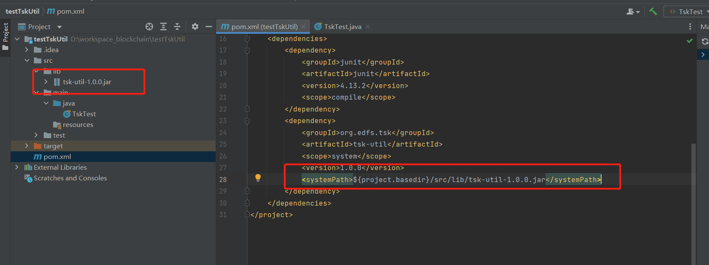

- [TOC]


# w3fs network Java language access instructions

The w3fs network provides its users with powerful and practical capabilities, including those related to blockchain, unrestricted types of file encryption and decryption, decentralized storage of files, etc. This collection of capabilities can be used in many real-world scenarios, such as in the field of NFT, which will allow NFTs to circulate in various forms without restriction on file types and without security risks under specific rules, or you can combine These capabilities to create any kind of Dapp you can imagine.
This document will provide a detailed description of the SDK docking process for JAVA services.

* Access instructions for the W3FS file encryption and decryption SDK.


Developers or development teams can choose targeted technologies to access based on their customized Dapps.

#### JAVA access instructions
After reading this instruction, you will learn about the product and how to use it, and quickly access and use it
## 1、About Products
#### **1.1.Features**

With a simple integration, you can use the SDK's functions of encrypting and decrypting files, sharing encrypted files, and transparently using files.
Encrypted file: It consists of encrypted envelope header (encrypted header length, encrypted header padding area) and the actual encrypted file body. The encrypted header length can be obtained through the getEncryptHeadLen() interface, and the encrypted header padding area can be obtained through the getHeadAndFillSumLen() interface.
Decrypted file: Also called file decryption, that is, the decrypted file is a new unencrypted file.
Share files: Share encrypted files (unencrypted files cannot be shared), and then add/delete the identity to be operated from the original encrypted file.
Transparent use of files: Files will not be decrypted (unencrypted files will not be generated). By enabling LocalServer and using WebView, encrypted files can be used directly and transparently without decryption.

#### **1.2 noun definition**

|noun|definition|
|-----|-----|
|Head| consists of encrypted header length and encrypted header padding area, including file operator, operation authority, operation period and other information (composes a complete encrypted file with Body)|
|Body|The actual encrypted file content (composes a complete encrypted file with the Head)|
|KeyId|Unique ID|
|FilePublicKey|File encryption and decryption public key|
|FilePrivateKey|File encryption and decryption private key|
|TaskId|Task id of file encryption and decryption operations|
|LocalServer|After enabling LocalServer, you can use WebView to decrypt encrypted files directly and transparently|
## 2、Java Access Guide (provide descriptions of each interface and common interface combinations that have completed core business functions)
**2.1 Import the SDK into the lib (or libs) directory of the project**

**2.2 Provides an easy way to create file encryption and decryption public and private key pairs and nIID for login**
```
//Ethereum account private key
String ethAccountPriKey = "";
IdentityIssueExBase64DTO identityIssueExBase64DTO = TskOperate.createBase64KeyPair(ethAccountPriKey);
//Return information: public key, private key, and nIID (keyId) used for login
{"nRet":0,"publicFileKey":"","publicFileKeyLen":78,"privateFileKey":"","privateFileKeyLen":112,"keyId":"","keyIdLen":20}

```
**2.3 Global initialization method (this method must be initialized at project startup)：**
```
//Example: Use the static keyword to initialize the project at startup or use CommandLineRunner to initialize
static {
    String keyId="";
    String privateFileKey="";
    //Return true to indicate successful initialization and false to indicate failure
    boolean b = TskOperate.initAccountAndPermission(keyId, privateFileKey);
    System.out.println("init :" + b);
}


@Component
public class InitData implements CommandLineRunner {
    @Override
    public void run(String... args) throws Exception {
        String keyId="";
        String privateFileKey="";
        boolean b = TskOperate.initAccountAndPermission(keyId, privateFileKey);
        System.out.println("init :"+b);
    }
}
```

**2.4 How to share：**
```
//File header stream Base64 string
String Head = "";
byte[] headByte = Base64Util.decodeString(saveFileInfoDTO.getHeadFileBase64());
//Ethereum address
String userAdd="0x123456789".substring(2);
//userAdd public key
byte[] userPubKeyByte = Base64Util.decodeString(UserFilePublicKey());
//nLastTime  -1 means no time limit, other timestamps represent the time limit when the file can be used (123456789)
byte[] bytes = TSKJni.FileOpTaskAdjustByFlow(headByte, headByte.length, true, Hex.decode(userAdd), (short) -1, -1, userPubKeyByte, userPubKeyByte.length);
 if (checkBytes(bytes)) {
    byte[] bytes1 = EthUtils.subBytes(bytes, 0,8, bytes.length-8);
    //Intercept the data after 8 bits and convert it into a Base64 string to return
    String encodeToString = Base64Utils.encodeToString(bytes1);
    retrun encodeToString;
 }

//////////////////////////////【Judging return information of sharing】/////////////////////////////////////////
//Determine whether the return is greater than 8 bits and determine whether the 4-byte operation result (ret) is: 0
public static boolean checkBytes(byte[] bytes){
        if(bytes.length<8){
            logger.error("Share error FileOpTaskAdjustByFlow returns:{}", Arrays.toString(bytes));
            return false;
        }
        byte[] bytes1 = EthUtils.subBytes(bytes, 0,0, 4);
        int i = EthUtils.bytesToInt(bytes1);
        return i==0;
    }
```

## 3、SDK  interface  description:
```
    ////////////////////////////////////////////////////////////////////////////////
                   [Calling method: initialization ==" int i = TSKJni.Init();]
    ////////////////////////////////////////////////////////////////////////////////
    //////////////////////////////////////////////////////////////////////////////
    //------Initialize the interface------
    //To use the TSK library, first call the initialization interface. If initialization fails, the TSK library will not be available.
    //It is no longer necessary to use the TSK library (usually a software exit), calling the reverse initialization interface.
    //////////////////////////////////////////////////////////////////////////////
    ////////////////////////////////////////////////////////////////////////////
    //name: TSKJni.Init
    //description: Initialize the TSK library
    //params:
    //return: Returns the result of initialization, as INT32, with the following semantics:
     // KError.Success, success;
     // KError.CantConnectKernel, failed, unable to connect to the kernel;
     // KError.Other, failed, other errors;
    ////////////////////////////////////////////////////////////////////////////
    public static native int Init();

    ////////////////////////////////////////////////////////////////////////////
    //name: TSKJni.UnInit
    //description: Reverse initialize the TSK library
    //params:
    //return:
    ////////////////////////////////////////////////////////////////////////////
    public static native void UnInit();

    //////////////////////////////////////////////////////////////////////////////
    //------Account interface------
    //User dependent; the library only supports single account login.
    //
    //Each identity has an internal ID.
     //The identity ID is assigned from 1, which means that 0 is specially reserved.
     //Each account may have multiple identities, but only one can represent the user identity of the account (representing this person).
    //////////////////////////////////////////////////////////////////////////////
    ////////////////////////////////////////////////////////////////////////////
    //name: TSKJni.LoginUser
    //description: Login account
    //params: nIID is the corresponding internal ID representing the unique identity of the user
    //return: Returns the result of the login account, which is INT32 with the following semantics:
     // KError.Success, success;
     // KError.MultiUser, failed, there are other logged in users;
     // KError.Other, failed, other errors;
    //remark:
    ////////////////////////////////////////////////////////////////////////////
    public static native int LoginUser(byte[] nIID);

    ////////////////////////////////////////////////////////////////////////////
    //name: TSKJni.LogoutUser
    //description: log out of current account
    //params:
    //return: Returns the result of logging out of the account, as INT32, with the following semantics:
     // KError.Success, success;
     // KError.NoUser, failed, no user is currently logged in;
     // KError.Other, failed, other errors;
    //remark:
    ////////////////////////////////////////////////////////////////////////////
    public static native int LogoutUser();

    //////////////////////////////////////////////////////////////////////////////
    //------Summary interface------
    //////////////////////////////////////////////////////////////////////////////
    ////////////////////////////////////////////////////////////////////////////
    //name: TSKJni.DigestCRC32
    //description: Iterative support for CRC32 digests of multiple streams
    //params: nFlowLen is the stream size that specifies the CRC32 digest for which to calculate
    //      pFlow is the stream specifying the CRC32 digest for which to calculate
    //      nCookie Specify the cookie required for iteration in
    //return: Return the summary result as a json string
     // Summary start return value {nRet=0,cookie=1000}
     // Summary in progress return value {nRet=0}
     // return value at the end of the digest {nRet=0,nCRC32=1000}
    //remark: CRC32 digest is a high-speed but unreliable digest algorithm, which can be used to verify the encrypted information block structure data itself.
     // This interface performs a joint digest of multiple streams.
     // The cookie will be obtained when the digest is started, and the value will remain unchanged until the end of the digest.
     // Simply put, the judgment is based on:
     // When the stream length nFlowLen is 0, and cookie, indicating the start of the digest
     // When the stream length nFlowLen is not 0 and the cookie is not 0, it means the digest is in progress
     // When the stream length nFlowLen is 0 and the cookie is not 0, it means the digest is over, return the final digest result, and clear the internal digest object
    //
    //     Typical usage is as follows:
    // 1. Call DigestCRC32(0,NULL,0) to start digest
    // Flows (nFlowLen and pFlow) are specified as empty (nFlowLen is 0, pFlow is NULL)
    // This means to initialize the digest algorithm and prepare to start a unified joint digest for multiple streams. And return the cookie value of the digest process, which uniquely corresponds to this joint digest
    // 2. Call DigestCRC32(nFlowLen, pFlow, pCookie) for each flow to indicate the digest
    // Flows (nFlowLen and pFlow) specify a specific flow
    // The digest cookie pointer (pCookie) is not 0, and the stored digest cookie is the digest cookie0 obtained in step 1
    // This tells the digest algorithm to digest the specified stream.
    // 3. Call DigestCRC32(0,NULL,pCookie) to end the digest and receive the result
    // Flows (nFlowLen and pFlow) are specified as empty (nFlowLen is 0, pFlow is NULL)
    // The digest cookie pointer (pCookie) is not NULL, and the stored digest cookie is the digest cookie obtained in step 1
    // This tells the digest algorithm to terminate and return the current (final) digest result.
    // Example, take the joint CRC32 digest of two streams as an example, the code is as follows:
    //      INT64 cookie=0;
    //      TSK.DigestCRC32(0,NULL,0);
    //      TSK.DigestCRC32(nFlowLen,pFlow,cookie);
    //      TSK.DigestCRC32(nFlowLen2,pFlow2,cookie);
    //      TSK.DigestCRC32(0,NULL,&cookie);
    ////////////////////////////////////////////////////////////////////////////
    public static native String DigestCRC32(int nFlowLen, byte[] pFlow, long nCookie);

    ////////////////////////////////////////////////////////////////////////////
    //name: TSKJni.DigestCRC32Single
    //description: CRC32 one-shot digest of data stream
    //params: nflowlen is the stream size that specifies the CRC32 digest for which to calculate
    //      buffer is the stream specifying the CRC32 digest for which to calculate
    //return: crc32 digest result
    //remark: CRC32 digest is a high-speed but unreliable digest algorithm, which can be used to verify the encrypted information block structure data itself.
    ////////////////////////////////////////////////////////////////////////////
    public static native int DigestCRC32Single(int nflowlen, byte[] buffer);

    ////////////////////////////////////////////////////////////////////////////
    //name: TSKJni.DigestMD5
    //description: Iterative support for MD5 digests of multiple streams
    //params: nFlowLen is the stream size that specifies the MD5 digest for which to calculate
    //      pFlow is the stream specifying the MD5 digest for which to compute
    //      nCookie Specify the cookie required for iteration in
    //return: Return the summary result as a json string
     // Summary start return value {nRet=0,cookie=1000}
     // Summary in progress return value {nRet=0}
     // The return value at the end of the summary is {nRet=0, MD5="abcded"} MD5 is a string encoded by base64, the external must be decrypted first, and the original length of the MD5 code is 16 bytes
    //remark: MD5 digest is a low-speed but reliable digest algorithm that can be used for signature verification of the file data itself.
     // The usage method is the same as TSK.DigestCRC32, except that a 16-byte buffer is used to receive the final result.
    ////////////////////////////////////////////////////////////////////////////
    public static native String DigestMD5(int nFlowLen, byte[] pFlow, long nCookie);

    ////////////////////////////////////////////////////////////////////////////
    //name: TSKJni.DigestMD5Single
    //description: MD5 single digest of data stream
    //params: nflowlen is the stream size that specifies the MD5 digest for which to calculate
    //      buffer is the stream specifying the MD5 digest for which to compute
    //return: Returns MD5 summary results
    //remark:
    ////////////////////////////////////////////////////////////////////////////
    public static native byte[] DigestMD5Single(int nflowlen, byte[] buffer);

    ////////////////////////////////////////////////////////////////////////////
    //name: TSKJni.DigestSha256
    //Description: Data Digest using Sha256 algorithm
    //Parameters: nFlowLen[IN],the length of the data
    //      pFlow[IN],the data
    //      nCookie[IN],the cookie of the Digest process
    //Return: Return digest results as a json string
    ////     Digest start return value {nRet=0,cookie=1000}
    ////     Digest in progress return value {nRet=0}
    //     Digest end return value {nRet=0,SHA256="abcded"} SHA256 is the string after base64 encoding, the original length of SHA256 code is 32 bytes
    //Remark: SHA256 digest is a reliable digest algorithm that can be used to digest arbitrary data.
    //      It is used in the same way as TSK_DigestCRC32, except that the final result is received in a 32-byte buffer.
    //
    ////////////////////////////////////////////////////////////////////////////
    public static native byte[] DigestSha256(int nFlowLen, byte[] pFlow, long nCookie);

    ////////////////////////////////////////////////////////////////////////////
    //name: TSKJni.DigestSha256Single
    //Description: SHA256 single digest of the data stream
    //Parameters: nflowlen[IN],the buffer length of data
    //      buffer[IN],the buffer of data
    //Return: the result of the MD5 digest
    //Remark:
    //Remark: The seeds for file encryption identity generation are generated by the sha256 digest algorithm of the W3FS Native SD library
    ////////////////////////////////////////////////////////////////////////////
    public static native byte[] DigestSha256Single(int nflowlen, byte[] buffer);

    //////////////////////////////////////////////////////////////////////////////
    //-------Identity(Asymmetric encryption algorithm) Interface------
    //////////////////////////////////////////////////////////////////////////////
    ////////////////////////////////////////////////////////////////////////////
    //name: TSKJni.IdentityIssueExBase64
    //Description: Generate (issue) an identity object,BASE64 string format
    //Parameters: pSeed[IN],the buffer of the seed,must 32-byte buffer
    //      nSeedLen[IN]，the length of the sedd,must 32
    //Return: Returns a json object string in the following format:
    //     {nRet:0,PublicKey:"abcd",PublicKeyLen:78,PrivateKey:"abcd",PrivateKeyLen:112,KeyID:"abcd",KeyIDLen:20}
    //     nRet is 0, the interface call is successful, other result values are valid
    //     PublicKey,PrivateKey is the key information base64 encoded data，Must be decoded to be usable
    //     PublicKeyLen,PrivateKeyLen,the length of the PublicKey and PrivateKey
    //     KeyID, the identity ID of the generated key used for file encryption, which is uniquely bound to the identity key
    //     KeyID, 20 bytes in length
    //Remark: Only ecc 256k1 algorithm is supported
    //      If the seed information is specified, the generated identity information will be consistent,
    //      and the seed information is required to be 32 bytes long.
    //      Can not be specified, will be randomly issued ID certificate
    //      The public key can be derived from the private key
    ////////////////////////////////////////////////////////////////////////////
    public static native String IdentityIssueExBase64(byte[] pSeed, int nSeedLen);

    ////////////////////////////////////////////////////////////////////////////
    //name: TSKJni.IdentityIssueGetPrivateKey
    //Description: Generate (issue) an identity object
    //Parameters: pSeed[IN],the buffer of the seed,must 32-byte buffer
    //      nSeedLen[IN]，the length of the sedd,must 32
    //Return: the privatekey
    //Remark: Get the corresponding public key and call the GetPublicKeyByPrivateKey interface with the returned private key.
    ////////////////////////////////////////////////////////////////////////////
    public static native byte[] IdentityIssueGetPrivateKey(byte[] jbyteArray, int nSeedLen);

    ////////////////////////////////////////////////////////////////////////////
    //name: TSKJni.IdentityGetPublicKeyByPrivateKey
    //Description: Deriving the public key from the private key
    //Parameters: pPrivateKey[IN],the buffer of the private key
    //      nPrivateKeyLen[IN]，the buffer length of the privatekey
    //Return: the publickey
    //Remark:
    ////////////////////////////////////////////////////////////////////////////
    public static native byte[] IdentityGetPublicKeyByPrivateKey(byte[] jbyteArray, int nSeedLen);

    ////////////////////////////////////////////////////////////////////////////
    //name: TSKJni.IdentityGetKeyIDByPublicKey
    //Description: Deriving the identity id from the public key
    //Parameters: pPublicKey[IN],the buffer of public key
    //      nPublicKeyLen[IN]，the buffer length of public key
    //Return: the identity id,20 bytes length
    //Remark:
    //////////////////////////////////////////////////////////////////////////// 
    public static native byte[] IdentityGetKeyIDByPublicKey(byte[] pPublicKey, int nPublicKeyLen);

    ////////////////////////////////////////////////////////////////////////////
    //name: TSKJni.SetHoldIdentity
    //Description: Set the identity held by the current user to the W3FS Native SDK library
    //Parameters: nListVerb[IN],the List operation verb, no LIST_VERB_MODIFY semantics
    //       nIdentityID[IN],the identity ID
    //       nPermission[IN],the permission of the identity
    //       nLastTime[IN],the last usage time of the identity pair file,must -1;
    //       pKeyBuf[IN],the buffer of the identity key
    //       nKeyLen[IN],the buffer length of the identity key
    //return: INT32, KError_Success,success;
    //          KError_CantConnectKernel,fail
    //          KError_NoUser,fail
    //          KError_SyntaxError,fail
    //          KError_MultiObject,fail
    //          KError_CantFindObject,fail
    //          KError_Other,fail
    //Remark: The identities held by the current user are a list,Management via LIST_VERB_CLEAR/LIST_VERB_ADD/LIST_VERB_DELETE
    //       When LIST_VERB_ADD, all parameters obviously need to be provided.
    //       When LIST_VERB_DELETE, the parameters obviously only need to provide the nIdentityID.
    //
    //       LIST_VERB_DEFAULT is to set the user's default identity;
    //       When setting (or changing) a default identity, that identity must be in the list of held identities, so the parameter only needs to provide the nIdentityID.
    //       When you want to clear the default identity, you should specify nIdentityID as IDENTITY_NULL, no other parameters should be provided.
    //
    //       All added identities suggest that nPermission be set to maximum permissions.
    ////////////////////////////////////////////////////////////////////////////
    public static native int SetHoldIdentity(int nListVerb, byte[] nIdentityID, short nPermissionInfo, int nLastTime, byte[] jbyteArray, int nKeyBufLen);

    //////////////////////////////////////////////////////////////////////////////
    //------Symmetric encryption algorithm interface------
    //Symmetric algorithm for data encryption and decryption of files.
    //////////////////////////////////////////////////////////////////////////////
    ////////////////////////////////////////////////////////////////////////////
    //name: TSKJni.GetCipherDesc
    //Description: Get all currently loaded algorithms
    //Parameters:
    //return: Return a description report of all symmetric encryption algorithms supported by the library for data encryption
    //     The json format is returned in the following format:
    //     [{tag:xxx,name:xxx,desc:xxxx},...]
    ////////////////////////////////////////////////////////////////////////////
    public static native String GetCipherDesc();

    ////////////////////////////////////////////////////////////////////////////
    //name: TSKJni.GetCipherInfo
    //Description: Get information about the specified algorithm
    //Parameters: strciphertag[IN],the tag,can be NULL,get the default item
    //Return: he json format is returned in the following format:
    //     {nRet:0,pKeyLength:16,pBlockSize:1}
    //     nRet is 0 for other fields to be valid, pKeyLength returns the length (in bytes) of the secret key required by the algorithm
    //      pBlockSize returns the group size required by the algorithm (in bytes, the sequence algorithm returns 1)
    //Remark: This interface can be used to determine the secret key size and group size of the algorithm when constructing the stream processing object.
    ////////////////////////////////////////////////////////////////////////////
    public static native String GetCipherInfo(String strciphertag);

    ////////////////////////////////////////////////////////////////////////////
    //name: TSKJni.SetDefaultCipher
    //Description: set the default algorithm
    //Parameters: strciphertag[IN],the tag of algorithm
    //Return: INT32,KError_Success,success;
    //          KError_CantConnectKernel,fail;
    //          KError_CipherError,fail;
    //          KError_Other,fail;
    //Remark:
    ////////////////////////////////////////////////////////////////////////////
    public static native int SetDefaultCipher(String strciphertag);

    ////////////////////////////////////////////////////////////////////////////
    //name: TSKJni.SetDefaultZone
    //Description: set the default encrypt zone length
    //Parameters: nLen[IN],the length of encrypt zone(in bytes)
    //Return: INT32,KError_Success,success;
    //          KError_CantConnectKernel,fail;
    //          KError_Other,fail;
    //Remark: Encrypt all data in a file by default
    ////////////////////////////////////////////////////////////////////////////
    public static native int SetDefaultZone(long nLen);

    ///////////////////////////////////////// ///////////////////////
    //name：TSKJni.FileOpTaskInit
    //Description: Initialize a file operation task
    //Parameters: nAction[IN],the Action verb，1,encrypt；2，decrypt；3，share
    //      nThreadCount[IN]，the task thread count,default value is 1
    //Return: Less than 0 means file operation task initialization failed
    //        Greater than or equal to 0 means success, the return value is the task ID, and the subsequent operations are indexed by ID
    //Remark: Multi-threaded execution on a file-by-file basis
    //        The number of multithreads can be set according to the current number of cpu
    /////////////////////////////////////////////////////////////////////////////////
    public static native int FileOpTaskInit(int nAction, int nThreadCount);

    /////////////////////////////////////////////////////////////////////////////////////////////////////////
    //name: TSKJni.FileOpTaskPushAFileToTask
    //Description: Add a full path to the file/folder awaiting operation to the specified file operation task
    //Parameters: nTaskID[IN],the task id,returned by TSK_FileOpTask_Init
    //      pSrcFullPath[IN]，the source file/folder path
    //      pDstFullPath[IN],the target file/folder path
    //Return:INT32, KError_Success,success;
    //Remark: Multiple files/folders can be processed in a single file operation task
    //      This interface can be called multiple times
    //      This function is only valid until the task is actually started, when the task state has been started, including when the task is suspended, it is not possible to call this interface again to finish adding the operation target
    //
    //      pSrcFullPath and pDstFullPath must be not the same path, and pSrcFullPath must be real
    ////////////////////////////////////////////////////////////////////////////////////////////////////////////////////////
    public static native int FileOpTaskPushAFileToTask(int nTaskID, String strSrcFilePath, String strDstFilePath);

    ///////////////////////////////////////////////////////////////////////////////////////////////////////////
    //name: TSKJni.FileOpTaskPushAAction
    //Description: Add a identity to the specified file share task
    //Parameters: nTaskID[IN],the task id,returned by TSK_FileOpTask_Init
    //      bDelAdd[IN],the action,true is add,false is delete
    //      IID[IN]，the identity ID
    //      nPermission,the permission of the identity
    //      nLastTime, the identity of the file last used time
    //      pKeyBuf[IN]，the buffer of the identity key
    //      nKeyBufLen，the buffer length of the identity key
    //Return:INT32, KError_Success,success;
    //Remark: This interface is only available for file sharing
    //////////////////////////////////////////////////////////////////////////////////////////////////////////////////////////////
    public static native int FileOpTaskPushAAction(int nTaskID, boolean bDelAdd, byte[] IID, short nPermission, int nLastTime, byte[] pKeyBuf, int nKeyBufLen);

    /////////////////////////////////////////////////////////////////////////////////////////////////////////////
    //name: TSKJni.FileOpTaskSetShareSign
    //Description: Set a file operation task signature action
    //Parameters: nTaskID[IN],the task id,returned by TSK_FileOpTask_Init
    //      nSignAction[IN],the signature action，0 means keep，1 means set，2 means clear
    //Return： INT32,KError_Success,success;
    //Remark: This interface is only available for file sharing
    /////////////////////////////////////////////////////////////////////////////////////////////////////////////////
    public static native int FileOpTaskSetShareSign(int nTaskID, byte nSignAction);

    ///////////////////////////////////////////////////////////////////////////////////////////////////////////////////////
    //name: TSKJni.FileOpTaskStartATask
    //Description: Start a file operation task
    //Parameters: nTaskID[IN],the task id,returned by TSK_FileOpTask_Init
    //Return:INT32,KError_Success,
    //Remark: The Set Parameters interface cannot be called after the task has started. Asynchronous operation, by starting an asynchronous multithread to complete the transaction
    ////////////////////////////////////////////////////////////////////////////////////////////////////////////////////////////
    public static native int FileOpTaskStartATask(int nTaskID);

    /////////////////////////////////////////////////////////////////////////////////////////////////////////////////////////
    //name: TSKJni.FileOpTaskCancelATask
    //Description: Stop a file operation task
    //Parameters: nTaskID[IN],the task id,returned by TSK_FileOpTask_Init
    //Return: INT32,KError_Success,success
    //Remark: The file operation task is an asynchronous multi-threaded operation, the return value of the interface call to abort a task simply returns whether the interface call was successful or not,
    //        and the state of the task is based on the result of the TSK_FileOpTask_GetATaskState interface call
    //      After the file operation task is cancelled, it cannot be opened again and the TSK_FileOpTask_UnInitATask interface should be called to destroy the task
    //      The file operation task is cancelled, the status of the completed operation will not be rolled back, and the task report is obtained through the TSK_FileOpTask_GetATaskReport interface
    ////////////////////////////////////////////////////////////////////////////////////////////////////////////////////////////
    public static native int FileOpTaskCancelATask(int nTaskID);

    ////////////////////////////////////////////////////////////////////////////////////////////////////////////////////////////
    //name: TSKJni.FileOpTaskUnInitATask
    //Description: Destroy a file operation task
    //Parameters: nTaskID[IN],the task id,returned by TSK_FileOpTask_Init
    //Return: INT32,KError_Success,success
    //Remark:  Tasks whose status is estimated and in progress are not allowed to be deleted, but have to wait for completion or be actively cancelled before they are allowed to be deleted
    ///////////////////////////////////////////////////////////////////////////////////////////////////////////////////////////
    public static native int FileOpTaskUnInitATask(int nTaskID);

    ///////////////////////////////////////////////////////////////////////////////////////////////////////////////////////////////
    //name: TSKJni.FileOpTaskGetATaskState
    //Description: Get a task state
    //Parameters: nTaskID[IN],the task id,returned by TSK_FileOpTask_Init
    //Return: The return value is passed as a json string，e.g.{nRet:0,nState:0,nTotalLength:1000,nCurrentLength:900},
    //      nTotalLength and nCurrentLength are 64-bit integers, in bytes
    //      nRet, the return value, only for KError_Success, the other fields are valid, otherwise the function call failed
    //      nTotalLength, the total data length of the file operation task (in bytes)
    //      nCurrentLength, the length of processed data (in bytes)
    //      nState, the current state of the task, 0 to be started, nTotalLength,nCurrentLength data is invalid
    //                                        1 Data processing is in progress (estimated data length stage), nTotalLength,nCurrentLength data is invalid
    //                                        2 Data processing in progress (processing data phase)
    //                                        3 data processing completed (all data processing successful), nTotalLength,nCurrentLength data invalid
    //                                        4 data processing completed (active cancellation), nTotalLength,nCurrentLength data invalid
    //Remark: The success of the task status does not mean that the file processing is successful. The file processing result is obtained through TSK_FileOpTask_GetATaskReport
    //      Once the task starts, it is recommended that 500ms is acquired in one cycle
    //      The conversion percentage has to handle an anomaly where nTotalLength is 0 and nCurrentLength is also 0. For example, the case of encrypting a large batch of empty files
    //////////////////////////////////////////////////////////////////////////////////////////////////////////////////////////////////
    public static native int FileOpTaskGetATaskState(int nTaskID);

    ///////////////////////////////////////////////////////////////////////////////////////////////////////////////////////////////
    //name: TSKJni.FileOpTaskCanExit
    //Description: the file operation module can exit
    //Parameters:
    //Return: 0 means that there is currently a task being executed and cannot be exited, 1 means that all tasks are currently executed and the program can be exited
    ////////////////////////////////////////////////////////////////////////////////////////////////////
    public static native int FileOpTaskCanExit();

    /////////////////////////////////////////////////////////////////////////////////////////////////////////////////////////////////
    //name: TSKJni.FileOpTaskGetATaskReport
    //Description: Get a task result report
    //Parameters: nTaskID[IN],the task id,returned by TSK_FileOpTask_Init
    //      nReportMode[IN],thr report mode，1Minimalist mode, the result report only returns the total number of files, the number of processed files, the number of successful files, the number of failed files, and the number of ignored files
    //                                  2Full mode, the result report includes specific document processing status in addition to returning the contents of the simple mode
    //Return: The return value is passed as a json string，
    //      e.g.:
    //     Minimalist mode:{ret:0,count：10，success：4，fail:1,ignore:5}
    //     Full mode:{ret:0,count：10，success：4，fail:1,ignore:5,
    //                   filelist:[{srcpath：c:\\1.txt,dstpath：d:\\1.txt,action:1,result：0}.。。]}
    ///////////////////////////////////////////////////////////////////////////////////////////////////////////////////////////////////////
    public static native String FileOpTaskGetATaskReport(int nTaskID, int nReportMode);

    ///////////////////////////////////////////////////////////////////////////////////////////////////
    //name: TSKJni.FileOpTaskAdjustByFlow
    //Description: Adjusts the specified encrypted header stream data by the given identity and related attributes to return the new encrypted header stream data
    //Parameters: pHeadFlowSrc[IN],the source head flow
    //      nHeadFlowSrcLen[IN],the source head flow length
    //      nIID[IN],the identity id
    //      nPermission[IN]，the permission of the identity
    //      nLastTime[IN],the identity of the file last used time
    //      pKeyBuf[IN],the buffer of the identity key
    //      nKeyBufLen[IN],the buffer length of the identity key
    //      bAdd[IN],the action of the operation，true add a identity，false delete a identity
    //Return: Return the serialized binary memory result：
    //      The memory structure is as follows:4-byte operation result(ret)+4-byte new header data length(nHeadFlowDstLen)+header data(pHeadFlowDst)
    //      The returned memory array should be parsed according to the format, and only if ret is KError_Success does the data that follows make sense
    //////////////////////////////////////////////////////////////////////////////////////////////
    public static native byte[] FileOpTaskAdjustByFlow(byte[] pHeadSrc, int nHeadFlowSrcLen, boolean bDelAdd, byte[] nIID, short nPermission, int nLastTime, byte[] pKeyBuf, int nKeyBufLen);

    ////////////////////////////////////////////////////////////////////////////////////////////////////////
    //name: TSKJni.FileOpGetESealInfoByPath
    //Parameters: Get all identity information in the eseal area of the specified file
    //Parameters: strFilePath[IN],the file path
    //Return: Returns an array of all identity IDs in the ESeal section of the file, 20 bytes per identity ID
    ///////////////////////////////////////////////////////////////////////////////////////////////////
    public static native byte[] FileOpGetESealInfoByPath(String strFilePath);

    ///////////////////////////////////////////////////////////////////////////////////////////////////
    //name: TSKJni.LocalServerStop
    //Description:Start the HttpLocalServer module
    //Parameters: nPort[IN],The port specified by LocalServer
    ////////////////////////////////////////////////////////////////////////////////////////////////////////
    public static native int LocalServerStart(int nPort);

    ///////////////////////////////////////////////////////////////////////////////////////////////////
    //name: TSKJni.LocalServerStop
    //Description: Stop the HttpLocalServer module
    ////////////////////////////////////////////////////////////////////////////////////////////////////////
    public static native int LocalServerStop();

    ///////////////////////////////////////////////////////////////////////////////////////////////////
    //name: TSKJni.LocalServerSetSystemTime
    //Description: Set the current system time
    //Parameters: nTime[IN],the current system time
    ////////////////////////////////////////////////////////////////////////////////////////////////////////
    public static native int LocalServerSetSystemTime(int nTime);

    ///////////////////////////////////////////////////////////////////////////////////////////////////
    //name: TSKJni.LocalServerGetSessionKey
    //Description: Get the current random key
    //Parameters:
    //Return:the random key
    //Remark:SessionKey is a fixed 20-byte length information, used for LocalSever authentication, after the library is started, the current SessionKey must be obtained, and the request to LocalServer must bring the obtained SessionKey.
    //     Used by LocalServer to determine if the request is valid
    ////////////////////////////////////////////////////////////////////////////////////////////////////////
    public static native String LocalServerGetSessionKey();

    ///////////////////////////////////////////////////////////////////////////////////////////////////
    //name: TSKJni.LocalServerSetCurrentDappParam
    //Description: Set the basic parameters of the current service dapp site
    //Parameters: strRootDir[IN],Full path information of the root directory of the current dapp site
    //      strDynamicFlag[IN]，Dynamic request identification, LocalServer will use this identification to determine whether to forward the request to the corresponding server, if you want to support the local LocalServer dynamic request forwarding, dapp development process should strictly adhere to their own definition of the request specification
    //                      There can be multiple dynamic request identifiers, separated by | signs, such as /d|/api|/opt, localserver requires that the dynamic request identifier must be at the beginning of the requested Uri
    //      strRemoteServer[IN],Dynamic request forwarding to remote servers.
    //      strIndexFileName[IN],Home page of local dapp, can pass NULL, default use index.html as home page
    //      strPemFilePath[IN],If the remote server address is configured as https, the SSL public key of the server should be provided to LocalServer in the form of a standard pem certificate file
    ////////////////////////////////////////////////////////////////////////////////////////////////////////
    public static native int LocalServerSetCurrentDappParam(String strDappRootDir, String strDynamicFlag, String strRemoteServer, String strIndexFileName, String strPemFilePath);

```
## 4、SDK interface returns description：
/////////////////////////////////////////////
//Defining Error Codes
//Error Code >=0,For success;
//Error Code <0,For failed;
/////////////////////////////////////////////

//success
KError_Success             0

//Success, but no stream data processed
KError_NoDataHandled          1

//Success, New object
KError_CreateObject           10

//Success, open the object
KError_OpenObject            11

//Success, open the object and overwrite it
KError_OverrideObject          12

//Failed, wrong length
KError_LengthError           -1

//Failed,Timeout
KError_TimeOut             -2

//Failed, insufficient buffer length
KError_OutOfLength           -3

//Failed to connect to the kernel
KError_CantConnectKernel        -10

//Failed, there is currently a file being served
KError_FileServing           -11

//Failed, multiple login users
KError_MultiUser            -20

//Failed, no user logged in
KError_NoUser              -21

//Failure, syntax error
KError_SyntaxError           -30

//Failed to find the object
KError_CantFindObject          -31

//Failure, multiple objects
KError_MultiObject           -32

//Failed, the object was not found at the moment
KError_MaybeFindObject         -33

//Failure, generic logic error
KError_CommonLogic           -34

//Failed, encryption algorithm error
KError_CipherError           -40

//Failure, internal error in encryption algorithm
KError_CipherInnerError         -41

//Failed, insufficient permissions
KError_PermissionDenied         -42

//Failed,Header Crc Check Error
KError_HeaderCrcError          -50

//Failed,ESealError
KError_IdentitySealError        -51

//Failed,Other Error
KError_Other              -100