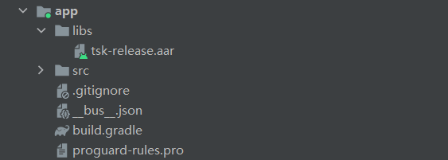
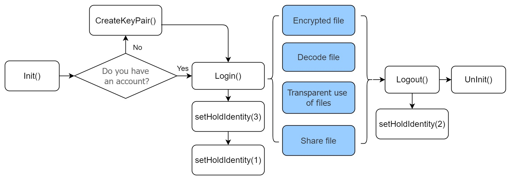
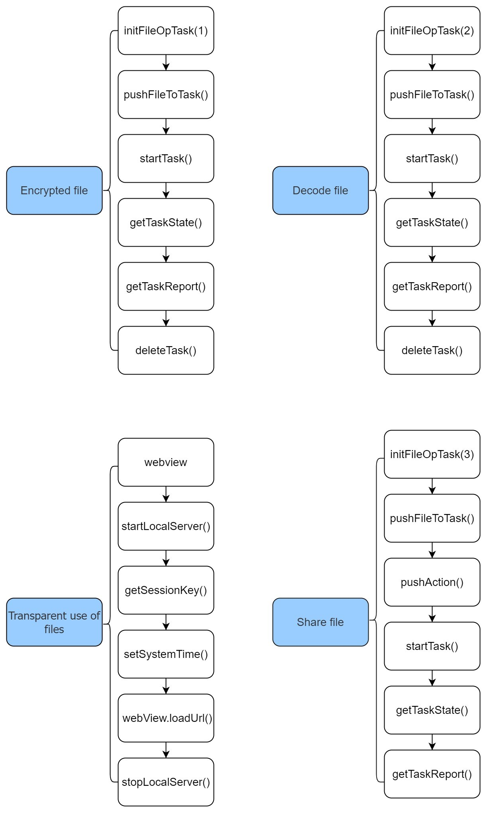

[TOC]

# W3FS network Kotlin language access instructions

The W3FS network provides its users with powerful and practical capabilities, including relevant technical capabilities in the blockchain field, unrestricted types of file encryption and decryption processing capabilities, and file decentralized storage capabilities. The collection of these technical capabilities can be applied to many real-world scenarios, such as in the field of NFT, which will enable NFT to carry out various forms of circulation without file type restrictions and no security risks under specific rules. You can also combine These capabilities create any form of Dapp you can imagine.
The following three technology integrations are described in detail in this document.
* Instructions for accessing the W3FS file encryption and decryption SDK.
* Code samples related to W3FS network access.
* W3FS network decentralized storage access instructions.

Developers or development teams can select targeted technologies to access according to their customized Dapps.

## W3FS-SDK Android access instructions
After reading this instruction, you will understand the product information and usage, quickly access and use this product

### 1.About the product

**1.1. Function introduction**
Through simple integration, you can use the SDK's functions of encrypting and decrypting files, sharing encrypted files, and transparently using files.
Encrypted file: It consists of encrypted envelope header (encrypted header length, encrypted header padding area), and the actual encrypted file body. The encrypted header length can be obtained through the getEncryptHeadLen() interface, and the encrypted header padding area can be obtained through the getHeadAndFillSumLen() interface.
Decrypted file: Also called file decryption, that is, the decrypted file is a new unencrypted file.
Share files: Share the encrypted file (unencrypted files cannot be shared), add/remove the identity to be manipulated in the original encrypted file. 
Transparent use of files: files will not be decrypted (unencrypted files will not be generated). By enabling LocalServer and using WebView, encrypted files can be used directly and transparently without decryption.

**1.2 Definition of terms**

| noun           | definition                                                   |
| -------------- | ------------------------------------------------------------ |
| Head           | consists of encrypted header length and encrypted header padding area, including file operator, operation authority, operation period and other information (form a complete encrypted file with Body) |
| Body           | Actual encrypted file content (composes a complete encrypted file with Head) |
| Seed           | Seed, which is defined by the user to generate the public and private keys for file encryption and decryption |
| KeyId          | Unique ID                                                    |
| FilePublicKey  | File encryption and decryption public key                    |
| FilePrivateKey | File encryption and decryption private key                   |
| TaskId         | The task id of file encryption and decryption operations     |
| LocalServer    | Use WebView with LocalServer enabled to use encrypted files transparently without decrypting them |
| SessionKey     | Used for LocalServer transparent decryption verification     |

### 2.Android Access Guide

**2.1 Import the SDK into the libs directory of the project**



**2.2 Add to the dependencies of the app's build.gradle file**

````
dependencies {
implementation fileTree(include: ['*.aar'], dir: 'libs')
....
}
````

**2.3 SDK provides a global instance that can be used directly:**

````
//kotlin
val w3fs = W3FS
w3fs.init()
//java
W3FS w3fs = W3FS.INSTANCE
w3fs.init()
````

**2.4 Initialization, it is recommended to be in Application**

````
class MyApplication : Application(){
override fun onCreate() {
super.onCreate()
W3FS.init()
...
}
}

Remember to use MyApplication in AndroidManifest.xml
<application
android:name=".MyApplication"
...
</application>
````

**2.5 Grant permissions**

````
Give network permissions, file read and write permissions in AndroidManifest.xml
<uses-permission android:name="android.permission.INTERNET" />
<uses-permission android:name="android.permission.WRITE_EXTERNAL_STORAGE" />
<uses-permission android:name="android.permission.READ_EXTERNAL_STORAGE" />
````

* SDK has integrated obfuscation, no need to configure obfuscation rules separately

### 3.Usage process

**3.1 Usage flowchart**





**3.2 Notes on use**

* After Login(), you need to call the setHoldIdentity() interface to add an identity and set the default identity.
* After Logout(), you need to call the setHoldIdentity() interface to clear all identities.
* A successful return from the getTaskState() interface only means that the task was executed successfully. Whether the specific file encryption and decryption processing is successful must be obtained by calling the getTaskReport() interface.
* For transparent use of files, remember to splicing Port and SessionKey into the url, as shown in the example of transparent use of files
* It is recommended to copy a copy of the file to be encrypted into the application sandbox, and set the encrypted file storage path to the application sandbox path to avoid file processing failure caused by the SDK's lack of file operation permissions. (*Note that the files in the sandbox will also be emptied when the app is uninstalled)

**3.3 Example of use**

**login**

````
W3FS.login(Config.keyId)
val r1 =
W3FS.setHoldIdentity(
TskConstant.ADD_IDENTITY,
Permission.ALL,
Permission.ALL,
Config.filePrivateKey
)
val r2 =
W3FS.setHoldIdentity(
TskConstant.DEFAULT_IDENTITY,
Permission.ALL,
Permission.ALL,
Config.filePrivateKey
)
````

**encryption**

````
val encryptTaskId = W3FS.initFileOpTask(TskConstant.TASK_ENCRYPT_ACTION, 1)
W3FS.pushFileToTask(encryptTaskId, file.absolutePath, encryptFileSavePath)
W3FS.startTask(encryptTaskId)
var isEncryptTaskSuccess = false
//Obtain the file operation status at an interval of 500ms
while (true) {
val taskStateModel = W3FS.getTaskState(encryptTaskId)
if (taskStateModel.nRet == 0) {
if (taskStateModel.nState == 3) {
//If the task status is successful, the file is successfully processed. You can obtain the file processing result from getTaskReport()
isEncryptTaskSuccess = true
break
} else if (taskStateModel.nState == 4) {
//The user cancelled the file operation task. Procedure
break
}
} else {
break
}
delay(500)
}
if(isEncryptTaskSuccess){
val encryptTaskReport =W3FS.getTaskReport(encryptTaskId, TskConstant.SIMPLE_REPORT)
if (encryptTaskReport.nRet == ResultCode.SUCCESS
&& encryptTaskReport.count == encryptTaskReport.success) {
//Encrypt success
}
}
W3FS.deleteTask(encryptTaskId)
````

**Decryption**

````
val decryptTaskId = W3FS.initFileOpTask(TskConstant.TASK_DECRYPT_ACTION, 1)
W3FS.pushFileToTask(decryptTaskId, file.absolutePath, decryptFileSavePath)
W3FS.startTask(decryptTaskId)
var isDecryptTaskSuccess = false
//Obtain the file operation status at an interval of 500ms
while (true) {
val taskStateModel = W3FS.getTaskState(decryptTaskId)
if (taskStateModel.nRet == 0) {
if (taskStateModel.nState == 3) {
//If the task status is successful, the file is successfully processed. You can obtain the file processing result from getTaskReport()
isDecryptTaskSuccess = true
break
} else if (taskStateModel.nState == 4) {
//The user cancelled the file operation task. Procedure
break
}
} else {
break
}
delay(500)
}
if(isDecryptTaskSuccess){
val decryptTaskReport = W3FS.getTaskReport(decryptTaskId, TskConstant.SIMPLE_REPORT)
if (decryptTaskReport.nRet == ResultCode.SUCCESS
&& decryptTaskReport.count == decryptTaskReport.success) {
//Decrypt success
}
}
W3FS.deleteTask(decryptTaskId)
````

**share**

````
val shareTaskId = W3FS.initFileOpTask(TskConstant.TASK_SHARE_ACTION, 1)
//To share a file, you can add an identity to the original encrypted file without entering the file saving path
W3FS.pushFileToTask(shareTaskId, file.absolutePath)
W3FS.pushAction(
shareTaskId,
"True:add, False:delete",
"Id of the user to be added",
"File permission",
"File usage time limit",
"The public key of the identity to be operated"
)
W3FS.startTask(shareTaskId)
var isShareTaskSuccess = false
//Obtain the file operation status at an interval of 500ms
while (true) {
val taskStateModel = W3FS.getTaskState(shareTaskId)
if (taskStateModel.nRet == 0) {
if (taskStateModel.nState == 3) {
//If the task status is successful, the file is successfully processed. You can obtain the file processing result from getTaskReport()
isShareTaskSuccess = true
break
} else if (taskStateModel.nState == 4) {
//The user cancelled the file operation task. Procedure
break
}
} else {
break
}
delay(500)
}
if(isShareTaskSuccess){
val shareTaskReport = W3FS.getTaskReport(shareTaskId, TskConstant.SIMPLE_REPORT)
if (shareTaskReport.nRet == ResultCode.SUCCESS
&& shareTaskReport.count == decryptTaskReport.success) {
//Share success
}
}
W3FS.deleteTask(shareTaskId)
````

**Transparent use **

````
Api fixed format: "http://127.0.0.1:${port}/api/open?key=${randomString}&path=${filePath}"
class MyWebViewActivity : AppCompatActivity() {
private var filePath: String = "Encrypted file path"
private lateinit var randomString: String
private lateinit var webView: WebView
private val port = 8088

override fun onCreate(savedInstanceState: Bundle?) {
super.onCreate(savedInstanceState)
setContentView(R.layout.my_webview_activity)
webView = findViewById(R.id.web)
W3FS.startLocalServer(port)
randomString = W3FS.getSessionKey()
W3FS.setSystemTime(ServiceTimeUtils.getServerTime().toInt())
webView.loadUrl(getLoadUrl())
}

private fun getLoadUrl(): String {
//http://127.0.0.1:port/api/open?key=xxxxx&path=xxxxxxxxxxx
return "http://127.0.0.1:${port}/api/open?key=${randomString}&path=${filePath}"
}

override fun onDestroy() {
webView.removeAllViews()
(webView.parent as ViewGroup).removeView(webView)
webView.destroy()
W3FS.stopLocalServer()
super.onDestroy()
}
}
````

### 4.interface description

**1. Initialization**

````
/**
* To use this SDK, first call the initialization interface. 
* If initialization fails, the SDK will become unavailable
* @return status code
*/
init () : Int

````


**2. Unbinding initialization**

````
unInit ()

````


**3. Start local service**

````
/**
*A local HttpLocalSerer module is integrated inside the SDK, which supports external use of standard http requests to obtain an encrypted The real data of the file, support in a non-kernel environment, through the browser way to decrypt an encrypted file without feeling 
* @param port: User-defined specified port
* @return status code
*/
startLocalServer(port: Int): Int
````

**4. Stop the local service**

````
/**
* stop local service
* @return status code
*/
stopLocalServer(): Int

````


**5. Set the current time of the system**

````
/**
* After the local LocalServer service is started, the current system time must be set externally, unit: seconds
* @return status code
*/
setSystemTime ( time : Int ) : Int
````


**6. Get random code**

````
/**
* After the local LocalServer service is started, the external must obtain the current SessionKey and request to LocalServer
* @return SessionKey
*/
getSessionKey(): String

````

**7.Login**

````
/**
* login
* @param keyId: Unique ID
* @return status code
*/

login(keyId: String): Int
````

**8.log out**

````
/**
* @return status code
*/
logout(): Int

````

**9.Set the identity held by the current account**

````
/**
* Sets the identity held by the current user
* After successful login, you need to invoke this interface to add
* and set the default identity
* @param action: 1:default
* 2:Clear all identity
* 3:Add identity
* 4:Delete identity
* 5:Change identity info
* @param permission: Permission is 2-byte, 16-bit data, each of which
represents a permission
-1: Allow all permissions
0: Read permissions
1: Owner permissions
2: Operation permissions
* @param lastTime: File usage permission time
* @param filePrivateKey: filePrivateKey
* @return status code
*/
setHoldIdentity(
action: Int,
permission: Short,
lastTime: Int,
filePrivateKey: String
): Int

````

**10.Generate file encryption and decryption key pair**

````
/**
* Create an identity key pair
* @param seed: Create w3fs key pair seed, seed information is
* mandatory to be 32 bytes long
* @return TskKeyPairModel=
* filePublicKey: file encryption and decryption public key
* filePrivateKey: file encryption and decryption private key
* keyId: Unique ID, KeyId is fixed at 20 bytes
* nRet: status code
*/
createKeyPair(seed: String): TskKeyPairModel
````

**11.Specify the private key of the seed generation file**

````
/**
* Generate a file private key from the seed
* @param seed: Create w3fs key pair seed, seed information is
* mandatory to be 32 bytes long
* @return PrivateKey
*/
getFilePrivateKeyByDigest(seed: String): String
````

**12.Separate the file public key from the file private key**

````
/**
* Separate the public key from the private key
* @param filePrivateKey: filePrivateKey
* @return PublicKey
*/
getFilePublicKeyByPrivateKey(filePrivateKey: String): String

````

**13.Calculate the KeyId through the public key**

````
/**
* Calculates the ID of the identity from the incoming public key
* @param filePublicKey: filePublicKey
* @return keyId, KeyId is fixed at 20 bytes
*/
fun getIdByPublicKey(filePublicKey: String):String

````

**14. Iteratively perform CRC32 digests on multiple data streams**

````
/**
* Iterate over multiple streams for CRC32 summarization
* @param flow: The stream to compute the CRC32 digest
* @param cookie: Specify the cookies needed for iteration
*
* @return Digest start return:{nRet=0,cookie=1000}
* Digest in progress return:{nRet=0}
* Digest end return:{nRet=0,nCRC32=1000}
*
* Use the sample:
* 1. Call digestCRC32(NULL, 0) This means to initialize the
digest algorithm, ready to start processing multiple
streams Unified joint digest. And return the cookie value
of the digest process, the cookie value uniquely
corresponds to this joint digest
* 2.Call digestCRC32(flow, cookie) for each stream to indicate
that the digest algorithm is used for the specified stream
Digest, where cookie is the digest cookie obtained in step 1
* 3.Call digestCRC32(NULL, cookie) to end the digest and return
the final digest result, The stored digest cookie is the
digest cookie obtained in step 1
* The following code:
* val cookie = digestCRC32(NULL,0)
* digestCRC32(flow,cookie)
* digestCRC32(flow2,cookie)
* val result = digestCRC32(NULL,cookie)
*/
digestCRC32(flow: ByteArray, cookie: Long): String

````

**15. Single CRC32 digest on the data stream**

````
/**
* CRC32 single summary of the data stream
* @param data: Calculate the data for the CRC32 digest
* @return CRC32 result
*/
digestCRC32Single(data: String): Int
````

**16. Iteratively perform MD5 digests on multiple data streams**

````
/**
* Iterate over multiple streams for MD5 summarization
* @param flow: The stream to compute the MD5 digest
* @param cookie: Specify the cookies needed for iteration
*
* @return Digest start return:{nRet=0,cookie=1000}
* Digest in progress return:{nRet=0}
* Digest end return:{nRet=0,MD5="abcded"} MD5 is a string
* encoded in Base64
*
* Use the sample
* 1. Call digestMD5(NULL, 0) This means to initialize the
digest algorithm, ready to start processing multiple
streams Unified joint digest. And return the cookie value
of the digest process, the cookie value uniquely
corresponds to this joint digest
* 2.Call digestMD5(flow, cookie) for each stream to indicate
that the digest algorithm is used for the specified stream
Digest, where cookie is the digest cookie obtained in step 1
* 3.Call digestMD5(NULL, cookie) to end the digest and return
the final digest result, The stored digest cookie is the
digest cookie obtained in step 1
* The following code:
* val cookie = digestMD5(NULL,0)
* digestMD5(flow,cookie)
* digestMD5(flow2,cookie)
* val result = digestMD5(NULL,cookie)
*/
digestMD5(flow: ByteArray, cookie: Long): String

````

**17. Single MD5 digest on the data stream**

````
/**
* MD5 single summary of the data stream
* @param data: Calculate the data for the MD5 digest
* @return MD5 result
*/
digestMD5Single(data: String): ByteArray

````

**18. Iteratively perform Sha256 digests on multiple data streams**

````
/**
* Iterate over multiple streams for Sha256 summarization
* @param flow: The stream to compute the Sha256 digest
* @param cookie: Specify the cookies needed for iteration
*
* @return Digest start return:{nRet=0,cookie=1000}
* Digest in progress return:{nRet=0}
* Digest end return:{nRet=0,SHA256="abcded"} SHA256 is a
* string encoded in Base64
*
* Use the sample
* 1. Call digestSha256(NULL, 0) This means to initialize the
digest algorithm, ready to start processing multiple
streams Unified joint digest. And return the cookie value
of the digest process, the cookie value uniquely
corresponds to this joint digest
* 2.Call digestSha256(flow, cookie) for each flow to indicate
that the digest algorithm is used for the specified flow
Digest, where cookie is the digest cookie obtained in step 1
* 3.Call digestSha256(NULL, cookie) to end the digest and return
the final digest result, The stored digest cookie is the
digest cookie obtained in step 1
* The following code:
* val cookie = digestSha256(NULL,0)
* digestSha256(flow,cookie)
* digestSha256(flow2,cookie)
* val result = digestSha256(NULL,cookie)
*/
digestSha256(flow: ByteArray, cookie: Long): String

````

**19. Single SHA256 digest on the data stream**

````
/**
* Sha256 single summary of the data stream
* @param data: Calculate the data for the Sha256 digest
* @return Sha256 result
*/
digestSha256Single(data: String): ByteArray

````

**20. Get all algorithm descriptions**

````
/**
* Get all algorithm descriptions
* @return Returns all symmetric encryption algorithms supported by
*W3FS
* CipherDescModel=
* name: algorithm name
* tag: the GUID tag of the algorithm
* desc: algorithm description
*/
getCipherDesc(): ArrayList<CipherDescModel>

````

**21. Get the specified algorithm information**

````
/**
* Gets the specified algorithm message
* @param tagCipher: tagCipher
* @return CipherInfoModel=
* nRet: status code
* pBlockSize: algorithm block size
* pKeyLength: algorithm key length
*/
getCipherInfo(tagCipher: String): CipherInfoModel
````

**22. Set the current default algorithm** (can not be set, the system has a default algorithm)

````
/**
* Setting the Default algorithm
* @param tagCipher: tagCipher
* @return status code
*/
setDefaultCipher(tagCipher: String): Int

````

**23. Set the default encryption section** (can not be set, the system encrypts the entire file by default)

````
/**
* Set the default encrypted paragraph
* @param len: Size of the default encrypted paragraph
* @return status code
*/
setDefaultZone(len: Long): Int

````

**24. Determine whether the file is encrypted**

````
/**
* Check whether the file is encrypted
* @param fileByte file Byte
* @return Encrypt true otherwise false
*/
fileIsEncrypt(fileByte: ByteArray): Boolean

fileIsEncrypt(path: String): Boolean

fileIsEncrypt(file: File): Boolean

````

**25. Get the version number of encrypted data format **

````
/**
* Gets the data format version number of the encrypted header
* @return Version
*/
getEncryptHeadVersion(fileByte: ByteArray): Int

getEncryptHeadVersion(file: File): Int

````

**26. Get the actual content length of the encrypted header **

````
/**
* Gets the actual content length of the encrypted message header
* @return Head length
*/
getEncryptHeadLen(fileByte: ByteArray): Int
 
getEncryptHeadLen(path: String): Int
 
getEncryptHeadLen(file: File): Int

````

**27. Get the length of the padding area of the encrypted header**

````
/**
* Gets the length of the padding area for the encrypted message
* header
* @return HeadFill length
*/
getEncryptHeadFillLen(fileByte: ByteArray): Int

getEncryptHeadFillLen(path: String): Int
 
getEncryptHeadFillLen(file: File): Int

````

**28. Get the total length of the encrypted header**

````
/**
* Gets the total length of the encrypted message header
* @return HeadAndFillSum length
*/
getHeadAndFillSumLen(filePath: String): Int
 
getHeadAndFillSumLen(file: File): Int

````

**29. Initialize file operation task**

````
/**
* Init file operation task
* @param action 1:Encrypt, 2:Decrypt, 3:Share
* @return taskId: file operation task id
*/
initFileOpTask(action: Int, threadCount: Int): Int

````

**30. Add the full path of a file/folder to be operated to the specified file operation task**

````
/**
* Add a file or folder to the specified file operation task
* @param taskId taskId
* @param sourceFullPath Full path of the file or folder to be operated
* @param saveFullPath Save the full path information of a file or folder
* @return status code
*/
pushFileToTask(taskId: Int, sourceFullPath: String, saveFullPath: String): Int

````

**31. Add an identity action to the specified task (only valid for sharing files)**

````
/**
* Adds an identity action to the specified file task
* @param taskId taskId
* @param delAdd true:add, false:delete
* @param permission permission
* @param lastTime Last-used time-bound information for the identity to be operated on
* @param filePublicKey The public key of the identity to be operated
* @return status code
*/
pushAction(
taskId: Int,
delAdd: Boolean,
permission: Short,
lastTime: Int,
filePublicKey: String
): Int

````

**32. Set file operation task signature action**

````
/**
* Sets a file operation task signing action
* @param taskId taskId
* @param signAction 0: Preserving signature Information
* 1: Setting signature Information
*2:Clearing Signature Information
* @return status code
*/
setFileSignAction(taskId: Int, signAction: Byte): Int

````

**33. Open file operation task**

````
/**
* Start the file operation task
* @param taskId taskId
* @return status code

*/
startTask(taskId: Int): Int
````

**34. Cancel the file operation task**

````
/**
* Cancel the file operation task
* @param taskId taskId
* @return status code
*/
cancelTask(taskId: Int): Int

````

**35. Whether the file operation task can be exited**

````
/**
* Whether the file operation task module can exit
* @return status code
*/
taskIsCanExit(): Int

````

**36, delete file operation task**

````
/**
* Delete the file operation task
* @param taskId taskId
* @return status code
*/
deleteTask(taskId: Int): Int
````

**37. Get the status of the file operation task**

````
/**
* Gets the file operation task status
* @param taskId taskId
*
* @return {nRet:0,nState:0,nTotalLength:1000,nCurrentLength:900},
* nRet: Refer to ResultCode return value definition
* nTotalLength:Total length of data to be processed
* nCurrentLength:Length of data processed
* nState: Current status of the file operation task,
* 0:Waiting to start
* 1:Data processing in progress(Estimate the data length phase)
* 2:Data processing in progress(Data processing stage)
* 3:Data processing completed(All data processed successfully)
* 4:Data processing completed(External active cancellation)
*
* If the task status is successful, it does not mean that the file is successfully processed.
* The file processing result can be obtained by invoking the task result report of obtaining file operation
* The file operation task is an asynchronous multithreaded task.
* The external can obtain the task status periodically by the operation task ID through a worker thread polling mode.
* To avoid frequent page refreshes, you are advised to set the interval to 500ms
* @return TaskStateModel=
* nRet: status code
* nCurrentLength: task processed data length
* nTotalLength: task comprehensive processing data length
* nState: the current state of the task
* 0: to be started
* 1:Data processing in progress
* 2:Data processing in progress
* 3: Data processing completed (all data processed
successfully)
* 4:Data processing completed (external active
cancellation)
*/
getTaskState(taskId: Int): TaskStateModel

````

**38. Get the file operation task result report**

````
/**
* Obtain the final result report of the file operation task
* @param taskId taskId
* @param reportMode 1:Simple report 2:Detailed report
*
* @return 1:{nRet:0,count:10,success:4,fail:1,ignore:5}
* 2:{nRet:0,count:10,success:4,fail:1,ignore:5,filelist:[{srcpath:c:\\1.txt,dstpath:d:\\1.txt,action: 1, result: 0}]}
* Property Field Description:
* nRet: status code
* count: the total number of tasks
* fail: the number of task failures
* ignore: the number of tasks to ignore
* success: the number of successful tasks
* filelist: detailed report information
* action: task action
* dstpath: save file destination path
* srcpath: the file path of the operation
* result: task status code
*/
getTaskReport(taskId: Int, reportMode: Int): TaskReportModel

````

**39. Obtain encrypted file identity area information**

````
/**
* Gets all the ID information for the file
* @param filePath filePath
* @return id ByteArray, Each identity ID is fixed at 20 bytes
*/
getFileIdentityInfo(filePath: String): MutableList<String>

````


### 5.return status code

````

//Success
const val SUCCESS = 0

//Success, but no stream data was processed
const val NO_DATA_HANDLED = 1

//Success,Create this object
const val CREATE_OBJECT = 10

//Success,Open the object
const val OPEN_OBJECT = 11

//Success,Open the object and overwrite it
const val OVERRIDE_OBJECT = 12

//Fail, length error
const val LENGTH_ERROR = -1

//Fail,timeout
const val TIME_OUT = -2

//Fail, Unable to connect to kernel
const val CANT_CONNECT_KERNEL = -10

//Fail, The file being served exists. Procedure
const val FILE_SERVING = -11

//Fail, Multiple login users
const val MULTI_USER = -20

//Fail,None Login user
const val NO_USER = -21

//Fail, Grammar mistakes
const val SYNTAX_ERROR = -30

//Fail, Multiple specified objects
const val CANT_FIND_OBJECT = -31

//Fail, Multiple specified objects
const val MULTI_OBJECT = -32

//Fail,The specified object cannot be found temporarily
const val MAYBE_FIND_OBJECT = -33

//Fail, General logic error
const val COMMON_LOGIC = -34

//Fail,Encryption algorithm error
const val CIPHER_ERROR = -40

//Fail, An internal encryption algorithm error occurs
const val CIPHER_INNER_ERROR = -41

//Fail,Failed to process the encryption header structure,CRC
const val HEADER_CRC_ERROR = -50

//Fail,Id envelope processing failed
const val IDENTITY_SEAL_ERROR = -51

//Fail,Other errors(Memory allocation error)
const val OTHER = -100

//file does not exist
const val FILE_DOES_NOT_EXIST = -1000

//File not encrypted
const val FILE_NOT_ENCRYPTED = -1001

//No share permission
const val NO_SHARE_PERMISSION = -1002

//Abnormal seed length
const val SEED_LENGTH_ERROR = -1003

//The file has been downloaded
const val File_Have_downloaded = -1004

````

***


## w3fs network transaction related access example
The purpose of this document is to help the development team understand the process and implementation methods related to w3fs's interaction with the chain. This document uses the kotlin language on the Android platform to use Ethereum Web3j as an example to introduce the implementation of functions related to accounts, assets, transactions, and smart contract calls.
### 1. resource dependency

Android accessors please download dependencies:
implementation ('org.web3j:core:4.8.7-android')

### 2. Relevant function code example
|noun|Paraphrase|
|-----|-----|
|rpcUrl|the domain name of the chain|
|chainId|chain id|
|contractAddress|Deployed smart contract address|


* 2.1 generate mnemonic
The mnemonic is generated by randomly selecting 12 permutations of specific 1024 English words. It is an important means of generating an account. The code for generating the mnemonic is as follows:
```
val mnemonics = MnemonicUtils.generateMnemonic()
```

* 2.2 Generate account by mnemonic
One mnemonic can generate N wallet accounts, and the specified account can be generated by specifying the index. code show as below:
```
var newKeyPair: ECKeyPair
var accountIndex = accountDao.getAccountIndex()
val seed = MnemonicUtils.generateSeed(mnemonic, "")
val rootKey = ExtendedPrivateKey.fromSeed(seed, Bitcoin.MAIN_NET)
do {
    val addressIndex = BIP44
                 .m()
                 .purpose44()
                 .coinType(KeyPairUtils.CoinTypes.ETH)
                 .account(0)
                 .external()
                 .address(accountIndex)
   val childPrivateKey = 
rootKey.derive(addressIndex, AddressIndex.DERIVATION)    newKeyPair = ECKeyPair.create(childPrivateKey.key)
    val newAddress = 
Keys.toChecksumAddress(Keys.getAddress(newKeyPair.publicKey))
```

* 2.3 Check balances
For all query interfaces of Web3j, you can view the related documents of Web3.js.
Contract query You can query related information, such as token balance, token name, token symbol, etc., through the contract method without consuming gas.
```
 //Check w3fs balance
 val balance = MainActivity.getWeb3j()
                    .ethGetBalance(Config.address, DefaultBlockParameterName.LATEST)
                    .send().balance

 //To query the token balance, the method name is balanceOf, and the parameter is the account address

        val methodName = "balanceOf"
        val inputParameters: MutableList<Type<*>> = ArrayList()
        val outputParameters: MutableList<TypeReference<*>> = ArrayList()
        val address = Address(fromAddress)
        inputParameters.add(address)
        val typeReference: TypeReference<Uint256> = object : TypeReference<Uint256>() {}
        outputParameters.add(typeReference)
        val function = Function(methodName, inputParameters, outputParameters)
        val data = FunctionEncoder.encode(function)
        val transaction =
            Transaction.createEthCallTransaction(fromAddress, contractAddress, data)
        val ethCall: EthCall
        var balanceValue = BigInteger.ZERO
        try {
            ethCall = web3j.ethCall(transaction, DefaultBlockParameterName.LATEST).send()
            val results = FunctionReturnDecoder.decode(ethCall.value, function.outputParameters)
            balanceValue = if (results != null && results.size > 0) {
                results[0].value as BigInteger
            } else {
                BigInteger.ZERO
            }
        } catch (e: IOException) {
            e.printStackTrace()
        }

```

* 2.4 trade

w3fsToken transfer
```
w3fsToken transfer estimation function
val transaction: Transaction = Transaction.createEtherTransaction(
                    fromAddress,
                    null, null, null, toAddress, BigInteger.ZERO
                )
w3fsToken transfer
                val ethEstimateGas = web3j.ethEstimateGas(transaction).send()
     val send = web3j.ethGetTransactionCount(
                        fromAddress, DefaultBlockParameterName.PENDING
                    ).send()
                   val  tempNonce = send.transactionCount
                val rawTransaction = RawTransaction.createEtherTransaction(
                    tempNonce, gasPrice, gasLimit, toAddress, value
                )
                val credentials =
                    Credentials.create(privateKey)
                //A signed Transaction
                val signMessage =
                    TransactionEncoder.signMessage(rawTransaction, chainId, credentials)
                val hexValue = Numeric.toHexString(signMessage)
                val ethSendTransaction =
                    web3j.ethSendRawTransaction(hexValue).send()

```


Contract transaction (take transfer token as an example)
```

//Initialize Web3
val web3j = Web3j.build(HttpService(rpc_url))

//Get the hex data of the transaction

val inputParameters: MutableList<Type<*>> = ArrayList()
 inputParameters.add(Address(model.to))
  inputParameters.add(Uint256(model.amount))
  val outputParameters: List<TypeReference<*>> = ArrayList()
  val function = Function(methodName, inputParameters, outputParameters)
val encodeFunctionData = FunctionEncoder.encode(function)
//data："0xa9059cbb000000000000000000000000c3a6aff8275ce26dd1a2666624300015a027709
//4000000000000000000000000000000000000000000000000002aa1efb94e0000"

//Estimated contract transaction gas
 val transaction =
Transaction(                        fromAddress,
                        null,
                        null,
                        null,
                        contractAddress,
                        BigInteger.ZERO,
                        functionParam
                    )
             
  val ethEstimateGas = web3j.ethEstimateGas(transaction).send()
 val send = web3j.ethGetTransactionCount(
                        fromAddress, DefaultBlockParameterName.PENDING
                    ).send()
                    send.transactionCount
                }
  val rawTransaction = RawTransaction.createTransaction(
                    tempNonce, gasPrice, gasLimit,
                    toOrContract, value, functionParam.trim())
  val signMessage = TransactionEncoder.signMessage(rawTransaction, chainId, credentials)
val hexValue = Numeric.toHexString(signMessage)
  val ethSendTransaction = web3j.ethSendRawTransaction(hexValue).send()


//get Nonce
val send = web3j.ethGetTransactionCount(fromAddress, DefaultBlockParameterName.PENDING).send()
   val nonce = send.transactionCount
//sign transaction
  val rawTransaction = RawTransaction.createTransaction(
                    tempNonce, gasPrice, gasLimit,
                    toOrContract, value, functionParam.trim()
                )
   val signMessage = 
TransactionEncoder.signMessage(rawTransaction, chainId, credentials)   val hexValue = Numeric.toHexString(signMessage)

//send transaction
  val ethSendTransaction = web3j.ethSendRawTransaction(hexValue).send()
```

* 2.6 View transaction status
```
//After initiating a transaction, view the transaction receipt
val transactionReceipt = web3j.ethGetTransactionReceipt(transactionHash).send()
```


***

## w3fs decentralized storage development documentation

### 1. Background introduction

As an important module of the w3fs network, w3fs decentralized storage is an efficient decentralized file storage system. It is technically combined with the DSCAN (proxy cdn) technology system to further improve the efficiency of file storage and download. His launch has greatly lowered the threshold for the use of decentralized storage, allowing everyone to easily get started and have an excellent user experience. The purpose of this document is to introduce to developers or development teams how to integrate and use w3fs network decentralized storage related services.

The following will explain in detail how to integrate the relevant functions of the decentralized storage of the w3fs network (please replace the example domain name (http://w3fsMainNet:8545) used in the following with the actual network of w3fs).

***

 

**Reading prerequisites**

* Have read the relevant documents of W3FS-SDK encryption and decryption.

* Familiar with web3js and smart contract function calls.

* Have read the code related to w3fs network transaction access.

* Understand the basic request and response messages of the http protocol.

* Understand the basic request and response messages of the RPC protocol.

 

***

### 2. Definition of nouns


| noun          | explain                                                      |
| ------------- | ------------------------------------------------------------ |
| Entire file   | When a file is stored, whether it is an encrypted file or not, it is uploaded and stored in the form of the entire file, which is called the entire file |
| Separate file | When the file is stored, first use the encryption interface in W3FS-SDK to encrypt the file, and then generate the file head and body, and upload and store the file separately, which is called separate file |
| oriHash       | Use the sha256 hash algorithm to calculate the 32-byte oriHash of the entire original file (unencrypted), starting with "0x", a total of 66 hexadecimal characters |
| storeKey      | The current user's account address (EOA) is spelled with oriHash (remove 0x) and the value obtained is called storeKey, which starts with "0x", a total of 106 hexadecimal characters |
| storeKeyHash  | Perform sha256 algorithm operation on storeKey again to get a 32-byte storeKeyHash, starting with "0x", a total of 66 hexadecimal characters |
| headHash      | The head (electronic envelope area) is encrypted and generated by W3FS-SDK, and the hash value obtained by the "SHA-256" digest algorithm of the head file starts with "0x", a total of 66 hexadecimal characters |
| bodyHash      | The hash value of the body part of the ciphertext encrypted by W3FS-SDK is obtained by the "SHA-256" digest algorithm, starting with "0x", a total of 66 hexadecimal characters |
| minerId       | Id of the storage node, starting with "0x", a total of 66 hexadecimal characters |
| fileExt       | File extension information                                   |
| fileSize      | File size                                                    |


 

***

 

### 3. Two usage scenarios of decentralized storage

In the decentralized storage file system of the w3fs network, two usage scenarios are designed in order to meet the needs of diversified users. 

1. Ordinary decentralized storage scenarios with data backup as the main purpose,Called **entire file storage**. 
2. The transaction scenario with the characteristics of file ownership and the security control of file permissions is called **separate file storage**. Users can choose which storage scenario to use according to their customized business needs.

It needs to be clear that the entire file and the separate file are two independent API implementations stored in the same decentralized storage file system, and the files stored in the two storage methods are unrelated to each other, that is to say,  a file file1 that has already stored the entire file in the storage node can also use the method of separate file to initiate storage again without being rejected in the same decentralized storage file system.

 

#### 3.1. Entire file storage ( ordinary decentralized storage scenario )

Like most decentralized storage, we offer to store a file directly into the w3fs network's decentralized storage file system. And before storage, according to different business requirements, the storage initiator can decide whether to encrypt and then store the file.

 

Before initiating the storage of a entire file, the following concepts need to be clarified:

* **address**: The EOA address of the user in the w3fs network, a 20-byte 16-mechanism string. For example: 0x687b5a626340EFfE324118F172092344Dd7FcB49.

* **oriHash**: Use the sha256 hash algorithm to calculate the 32-byte oriHash for the entire file to be stored (whether the file itself is encrypted or not). Such as: 0xe8452fc5541baa5c085455ba769cd163542cc491d05c721682153fde149bda22

* **storeKey**: Add oriHash to address (oriHash removes 0x during splicing) to get storeKey. For example: 0x687b5a626340EFfE324118F172092344Dd7FcB49e8452fc5541baa5c085455ba769cd163542cc491d05c721682153fde149bda22

* **storeKeyHash**: Perform the sha256 algorithm operation on the storeKey again to obtain a 32-byte storeKeyHash. For example: 0x5a31eb46ec62617cc4416746f14b7a777007441a477d1e87344a65ae35460c10

 

##### entire file storage core process

* a.**Calculation file storage information**

Dapp selects the file file1 to be stored (whether the file is encrypted or not), and calculates the oriHash, storeKey, and storeKeyHash of file1. And get the file size and file type of file1.

***

 

* b. **Select the target node for file storage**.

Call the json-rpc interface (w3fs_getMiners4Entire) provided by the decentralized storage to obtain the node list. Select a node as the storage destination node. It should be reminded that for the same file, when the entire file is used for storage, each node can only successfully store it once, unless the same file is stored on different nodes to achieve the purpose of multi-node backup.

```
curl -H "Content-Type:application/json" -X POST --data '{"jsonrpc":"2.0","method":"w3fs_getMiners4Entire","params":[{ "minerNum":4,"storeKey ":" 0x687b5a626340EFfE324118F172092344Dd7FcB49e8452fc5541baa5c085455ba769cd163542cc491d05c721682153fde149bda22 "}],"id":1}'

http://w3fsMainNet:8545

Parameter Description:
minerNum: Specifies the number of storage nodes returned.
storeKey: The storeKey is obtained by spelling the address with oriHash (oriHash without 0x) .
type: The returned node list type. stored (default), unstored, both.
 

Return data description:

{"jsonrpc":"2.0","id":1,"result":[{"minerId":"0x741e86df5954cab0ffa480085c18c1e23ab0958851caa89e5e38adad9bcf5f16","status":false,"publicKey":"304d03020700020120022100f863e92900a68cf033f253be61f80e188ecf41b3032544fd72c069995ec8d2b4022100e29346cfe14f1d7ba9e3685cf5e2d59c0cd75aba6f64ea533f1d62c7d9881eee","freeSpaceRatio":0.33}]}

Parameter Description:

minerId : Node Id.
status : Whether the file corresponding to the storeKey has a storage record on this node. In actual use, which nodes can be stored and which nodes have been stored can be selected according to the field value.
publicKey: The public key for encryption and decryption of the file corresponding to the node. (Required for separate file storage scenarios)
freeSpaceRatio: The free space ratio. (The ratio of the free storage space of each node in the returned list)

Absenteeism selection recommendation algorithm: the value of freeSpaceRatio in the node list returned by the requester calling the interface is accumulated in sequence, and the value is 1. Dapp can generate a random number with a value of 0 to 1 locally, which is decremented in the order of the returned node list. Go to the freeSpaceRatio value of each node until the generated random number is less than or equal to 0, the current node is the hit storage node.
   

 

```

***

 

* c. **Call the storage contract to save the storage information**.

In order to ensure the purity of the decentralized storage environment, it is necessary to register the file information in the smart contract associated with the decentralized storage before initiating storage.

The called **storage smart contract address is fixed as: 0x000000000000000000000000000000000003002**. The contract function for file information registration is defined as follows:

```
To ensure the purity of the W3FS storage environment, a small amount of value and gas needs to be paid before storing files.First call the function in the following contract to obtain the cost of the file to be stored this time.

function getFileCost(
uint256 fileSize, //The size of the file
)

After calling this function,You can obtain a value of type Uint256 stored this time.

Contract file information registration function and related parameters,At the same time, you need to pay the value of the file store obtained in the previous step

function createFileStoreInfo4Entire(

bytes32 storeKeyHash, //storeKey is the 32-byte value calculated by sha256, starting with 0x

uint256 fileSize, //The size of the file

   string calldata fileExt, //type of file

bytes32 minerId //Selected storage node Id

)

The event emitted after the contract invocation is successful

event newFileStoreEvt(

bytes oriHash, // for the entire file: oriHash, for the separate file: storeKeyHash

address userAddr, // user address

uint256 fileSize, // fileSize

string fileExt,

bytes minerId, // minerId

bytes headHash, // headHash

bytes bodyHash, // bodyHash

uint256 operTime // operTime

);

```

Wait for the transaction to return to the logs log to make sure the message has been processed. If the registration is completed, proceed to the following steps. Otherwise continue to wait or exit. Storage requests that have not yet registered the file information in the storage contract will be rejected by the system.

***

 

* d. **Start file upload**

File upload can decide which upload method to use according to the size of the file to be uploaded. There are two ways of uploading small files and uploading large files in slices. Small files and large files are generally limited to 30M. Dapp can decide which upload method to use according to its own needs and scenarios.

For the specific upload implementation, please refer to the detailed introduction to file upload in Chapter 4.

***

 

* e. **call file storage**

After the file is uploaded, you can call the json-rpc interface (w3fs_clientSend4Entire) of the entire file storage to start the storage.

**Request data**

```
 curl -H "Content-Type:application/json" -X POST --data '{"jsonrpc":"2.0","method":"w3fs_clientSend4Entire","params":[{"storeKey":"0x211fA1DDbE3d000e1a42921eC56bBE7A923A6BeDe8452fc5541baa5c085455ba769cd163542cc491d05c721682153fde149bda22", "minerId":"0x0ffeb2e287089058b7b7e93284c8107cef04b3ac693e826233aa0c2b802a42a2","file":"0xe8452fc5541baa5c085455ba769cd163542cc491d05c721682153fde149bda22"}],"id":1}' http://w3fsMainNet:8545

```

| parameter name | type   | description                                                  |
| -------------- | ------ | ------------------------------------------------------------ |
| storeKey       | String | Hexadecimal string starting with 0x, a total of 106 characters, composed of user EOA address + oriHash (without 0x) |
| minerId        | string | hexadecimal string starting with 0x, a total of 66 characters, must be the same minerId provided when calling the storage contract to save the information |
| file           | String | The result of the sha256 algorithm calculation of the uploaded file, the hexadecimal string starting with 0x, a total of 66 characters |

**Return value description**

Status: 200- means the submission is successful, 500 means the submission fails, and the specific error information is given in the Message

 

 

***

 

* f. **Query file storage status**

After calling the file storage rpc interface and returning successfully, you need to query the storage status. Only the files that have been stored can be downloaded normally. It is recommended to poll the json-rpc interface (w3fs_getStorageStatus4Entire) for querying the storage status.

**Request data**

 

```
curl -H "Content-Type:application/json" -X POST --data '{"jsonrpc":"2.0","method":"w3fs_getStorageStatus4Entire","params":[{ "storeKey":"0x211fA1DDbE3d000e1a42921eC56bBE7A923A6BeDe8452fc5541baa5c085455ba769cd163542cc491d05c721682153fde149bda22", "minerId":"0x0ffeb2e287089058b7b7e93284c8107cef04b3ac693e826233aa0c2b802a42a2"}],"id":1}' http://w3fsMainNet:8545

```

| parameter name | type   | description                                                  |
| -------------- | ------ | ------------------------------------------------------------ |
| storeKey       | String | A hexadecimal string starting with 0x, a total of 106 characters, composed of user EOA address + oriHash (without 0x) |
| minerId        | string | A hexadecimal string starting with 0x, a total of 66 characters, must be the same as the minerId provided when calling the start storage |

**Return value description**

   

```
{"jsonrpc":"2.0","id":1,"result":{"Status":200,"Message":"success","Timestamp":"2022-03-28T05:51:11.711594603Z" }}

```

​      

 

Status: 0 means initial, 100 means being processed, 200- means submission is successful, 400 means timeout, 500 means storage failure, and Message gives specific error information.

In particular, if it is 200, it means that the storage is complete. If it is 100, when submitting clientSend with the same parameters again, the request will be ignored.

Status: 200- means the submission is successful, 500 means the submission fails, and the specific error information is given in the Message

 

***

 

##### Download process of the entire file

A file can be downloaded if it has been stored normally in the decentralized storage of the w3fs network and the storage status is completed. Downloads for w3fs Network Decentralized Storage are free. The download is divided into two steps: 1. Retrieve the file, 2. Download the file.

* **Call the retrieval json-rpc interface (w3fs_clientRetrieval4Entire) of the entire file to retrieve the file**.

**Request data**

```
curl -H "Content-Type:application/json" -X POST --data '{"jsonrpc":"2.0","method":"w3fs_clientRetrieval4Entire","params":[{ "storeKey":"0xcdd122382f79686f9a46c37a899f2a6c5ff119097ef938e3998f3a32a7774 ],"id":1}' http://w3fsMainNet:8545

```

| parameter name | type   | description                                                  |
| -------------- | ------ | ------------------------------------------------------------ |
| storeKey       | String | A hexadecimal string starting with 0x, a total of 106 characters, composed of user EOA address + oriHash (without 0x) |

 

**Return value description**

Status: 200- means the submission is successful, 500 means the submission fails, and the specific error information is given in the Message

       If 200 is returned, Message is a json string in the format of the example below.

```
{"jsonrpc":"2.0","id":1,"result":{"Status":200,"Message":"{\"FileExt\":\"txt\",\"FileSize\": 1234}","Timestamp":"2022-06-02T07:04:44.244707303Z"}}

```

**Query file retrieval status (w3fs_clientRetrieval4Status)**

**Request data**

```
curl -H "Content-Type:application/json" -X POST --data '{"jsonrpc":"2.0","method":"w3fs_clientRetrieval4Status","params":[{ "storeKey":"0xcdd122382f79686f9a46c37a899f2a6c5ff119097ef938e3998f3a32a774 ],"id":1}'

```

| parameter name | type   | description                                                  |
| -------------- | ------ | ------------------------------------------------------------ |
| storeKey       | String | A hexadecimal string starting with 0x, a total of 106 characters, composed of user EOA address + oriHash (without 0x) |

 

**Return value description**

Status: 0 means initial, 100 means being retrieved, 200- means successful submission, 400 means timeout, 500 means submission failure, and Message gives specific error information.

In particular, if it is 200, further downloads can be made. If it is 100, submitting clientRetrieval4Entire again will be ignored.

 

```
{"jsonrpc":"2.0","id":1,"result":{"Status":200,"Message":"","Timestamp":"2022-03-25T09:22:38.542321127Z"} }

```

 

 

 

***

  

* Start file download

If the file retrieval status returns Completed. You can start the download of the file. For the specific download implementation, please refer to the detailed introduction to the entire file download in Chapter 4.

 

 

***


#### 3.2 separate file storage

Different from the storage of the entire file, the separate file storage refers to the file storage type that conforms to the W3FS protocol specification. Its core is an encrypted file. In order to facilitate access control and distribution, the file is split into a file header and a file body, and the two files are uploaded, stored, retrieved, downloaded, and then spliced into a single file for use.

The separate file must be encrypted, and the encryption method provided by the W3FS protocol is required to generate the file head and the file body.

Separate file storage is suitable for some scenarios where Dapp needs to adjust the file authorization. The core of his operation is to call the authorization interface of W3FS-SDK before storing the file after the file is encrypted to grant the identity managed by Dapp the permission to operate the file. After the file is downloaded, the identity managed by Dapp has been granted modification before storage. Therefore, the file head can be dynamically adjusted, and finally assembled with the file body into a complete file with new identity information. The core purpose of this operation process is that when some uploaded separate files need to be authorized to modify the identity, there is no need to re-store a new complete encrypted file after adjusting the file permissions every time.

##### Separate file storage core process

**a. Encryption**. The dapp calls the encryption interface of W3FS-SDK (for the specific implementation, please refer to the W3FS-SDK access documentation) to encrypt the files to be stored and generate the file head and body. There is only one Owner authority by default in the head. The dapp side decides whether to add other identity accounts for adjusting the file head according to its own business needs, such as the identity managed by the central server or the identity of the storage node (which requires the auxiliary authorization of the decentralized storage system). The identity of the storage node can be added to the separate file). 

 

***

* **b. Select the target node for storage**.

Call the json-rpc interface (w3fs_getMiners) provided by the decentralized storage to obtain the node list. Select a node as the storage destination node. It should be reminded that the same file can be stored on different nodes multiple times, but a separate file in each node can only be successfully stored once.

```
curl -H "Content-Type:application/json" -X POST --data '{"jsonrpc":"2.0","method":"w3fs_getMiners","params":[{ "minerNum":50,"oriHash ":"0x687b5a626340EFfE324118F172092344Dd7FcB49e8452fc5541baa5c085455ba769cd163542cc491d05c721682153fde149bda22"}],"id":1}'

http://w3fsMainNet:8545

Parameter Description:
minerNum: Specifies the number of storage nodes returned.
oriHash: The hexadecimal string of the sha256 value of the plaintext of the file.
type: The returned node list type. stored (default), unstored, both.
 

Return data description:

{"jsonrpc":"2.0","id":1,"result":[{"minerId":"0x741e86df5954cab0ffa480085c18c1e23ab0958851caa89e5e38adad9bcf5f16","status":false,"publicKey":"304d03020700020120022100f863e92900a68cf033f253be61f80e188ecf41b3032544fd72c069995ec8d2b4022100e29346cfe14f1d7ba9e3685cf5e2d59c0cd75aba6f64ea533f1d62c7d9881eee","freeSpaceRatio":0.33}]}

 

Parameter Description:
minerId: Node Id.
status: Whether the file corresponding to the storeKey has a storage record on the node.
publicKey: The public key for encryption and decryption of the file corresponding to the node.
freeSpaceRatio: The free space ratio. (The ratio of the free storage space of each node in the returned list)

Absenteeism selection recommendation algorithm: the value of freeSpaceRatio in the node list returned by the requester calling the interface is accumulated in sequence, and the value is 1. Dapp can generate a random number with a value of 0 to 1 locally, which is decremented in the order of the returned node list. Go to the freeSpaceRatio value of each node until the generated random number is less than or equal to 0, the current node is the hit storage node.
 

```

 

***

* **c. Invoke the storage contract to save the storage related information of the separate file**.

Like the entire file storage, the information of the separate files needs to be registered in the storage smart contract before starting the storage. The smart contract registration function is defined as follows:

```
Separate file registration file information contract method and parameters

function createFileStoreInfo(

bytes32 oriHash,//The 32-byte hexadecimal string calculated by the sha256 algorithm of the plaintext state of the file

uint256 fileSize, //The size of the encrypted file. (total size of head and body)

string calldata fileExt,//type of file

bytes32 minerId,//Storage node Id

bytes32 headHash,//The 32-byte hexadecimal string calculated by the sha256 algorithm of the head part of the file

bytes32 bodyHash //The 32-byte hexadecimal string calculated by the sha256 algorithm of the body part of the file

)

The event emitted after the contract invocation is successful

event newFileStoreEvt(

bytes oriHash, // for the entire file: storeKeyHash, for the separate file: oriHash

address userAddr, // user address

uint256 fileSize, // fileSize

string fileExt,

bytes minerId, // minerId

bytes headHash, // headHash

bytes bodyHash, // bodyHash

uint256 operTime // operTime

);

```

Wait for the transaction to return to the logs log to make sure the message has been processed. If the registration is completed, proceed to the following steps. Otherwise continue to wait or exit.

 

***

* **d. upload files (head and body are uploaded separately)**.

When uploading a separate file, you need to divide it into two separate files, head and body, for uploading. File upload can decide which upload method to use according to the size of the file to be uploaded. There are two ways of uploading small files and uploading slices of large files. There are no fixed restrictions on the definition of small files and large files, and Dapp can decide which upload method to use according to its own special scenarios.

For the specific upload implementation, please refer to the detailed introduction to the separate file upload in Chapter 4.

***

* **e.store separate files (head and body are stored separately)**.

Like uploading, the storage of separate files also needs to be divided into two parts for storage calls.

**Request data**

```
curl -H "Content-Type:application/json" -X POST --data '{"jsonrpc":"2.0","method":"w3fs_clientSend","params":[{"oriHash":"0x211fA1DDbE3d000e1a42921eC56bBE7A923A6BeDe8452fc5541baa5c085455ba769cd163542cc491d05c721682153fde149bda22", "minerId":"0x0ffeb2e287089058b7b7e93284c8107cef04b3ac693e826233aa0c2b802a42a2","headFlag":true,"file":"0xe8452fc5541baa5c085455ba769cd163542cc491d05c721682153fde149bda22"}],"id":1}' http://w3fsMainNet:8545

```

| parameter name | type    | description                                                  |
| -------------- | ------- | ------------------------------------------------------------ |
| oriHash        | String  | A 32-byte hexadecimal string with a 0x prefix calculated by the sha256 algorithm of the source file, a total of 66 characters |
| minerId        | string  | A hexadecimal string starting with 0x, a total of 66 characters, must be the same minerId |
| headFlag       | boolean | Whether the uploaded file part is the file header            |
| file           | string  | A 32-byte hexadecimal string with a 0x prefix calculated by the sha256 digest algorithm for the head or body of the file, a total of 66 characters |

**Return value description**

Status: 200 means the submission is successful, 500 means the submission fails, and the specific error information is given in the Message

 

***

* **f. query file storage status**

After calling the storage rpc interface of the separate file and returning successfully, you need to query the storage status. Only the files that have been stored can be downloaded normally. Don't remind me that the retrieval of a separate file also requires two file parts to be retrieved separately. Only when both parts are stored can the storage of the separate file be completed. It is recommended to call the rpc interface (getStorageStatus) for querying the storage status by polling.

**Request data**

 

```
curl -H "Content-Type:application/json" -X POST --data '{"jsonrpc":"2.0","method":"w3fs_getStorageStatus","params":[{ "oriHash":"0x211fA1DDbE3d000e1a42921eC56bBE7A923A6BeDe8452fc5541baa5c085455ba769cd163542cc491d05c721682153fde149bda22", "minerId":"0x0ffeb2e287089058b7b7e93284c8107cef04b3ac693e826233aa0c2b802a42a2","headFlag":true}],"id":1}' http://w3fsMainNet:8545

```

| parameter name | type    | description                                                  |
| -------------- | ------- | ------------------------------------------------------------ |
| oriHash        | String  | A 32-byte hexadecimal string with a 0x prefix calculated by the sha256 algorithm of the source file, a total of 66 characters |
| minerId        | string  | A hexadecimal string starting with 0x, a total of 66 characters, must be the same minerId |
| headFlag       | boolean | Whether the uploaded file part is the file header            |

​       

**Return value description**

  

```
{"jsonrpc":"2.0","id":1,"result":{"Status":200,"Message":"success","Timestamp":"2022-03-28T05:51:11.711594603Z" }}

```

​     

 

Status: 0 means initial, 100 means being processed, 200- means submission is successful, 400 means timeout, 500 means storage failure, and Message gives specific error information.

In particular, if it is 200, it can indicate that the storage is complete. If it is 100, when submitting clientSend with the same parameters again, the request will be ignored.

Status: 200- means the submission is successful, 500 means the submission fails, and the specific error information is given in the Message

 

***

  

##### Separate file download

Like the entire file download process, the separate file download process is also divided into two parts: file retrieval and file download. The difference from the entire file is that the retrieval and download of the separate file are divided into two independent files.

**File retrieval (head or body) (w3fs_clientRetrieval)**.

**Request data**

```
curl -H "Content-Type:application/json" -X POST --data '{"jsonrpc":"2.0","method":"w3fs_clientRetrieval","params":[{ "oriHash":"0xcdd122382f79686f9a46c37a899f2a6c5ff119097ef938e3998f3a32a7774d8" "headFlag":true}],"id":1}'

```

| parameter name | type    | description                                                  |
| -------------- | ------- | ------------------------------------------------------------ |
| oriHash        | String  | A 32-byte hexadecimal string with a 0x prefix calculated by the sha256 algorithm of the source file, a total of 66 characters |
| headFlag       | boolean | Whether the uploaded file part is the file header            |

 

**Return value description**

Status: 200- means the submission is successful, 500 means the submission fails, and the specific error information is given in the Message

If it returns 200, the Message is a json string in the format of the example below.

```
{"jsonrpc":"2.0","id":1,"result":{"Status":200,"Message":"{\"FileExt\":\"txt\",\"FileSize\": 1234}","Timestamp":"2022-06-02T07:04:44.244707303Z"}}

```

***

 

* **Query file retrieval status (head or body) (w3fs_getRetrievalStatus)**.

  

```
curl -H "Content-Type:application/json" -X POST --data '{"jsonrpc":"2.0","method":"w3fs_getRetrievalStatus","params":[{ "oriHash":"0xcdd122382f79686f9a46c37a899f2a6c5ff119097ef938e3998f3a32a7774d" "headFlag":true}],"id":1}' http://neleMainNet:8545

```

| parameter name | type    | description                                                  |
| -------------- | ------- | ------------------------------------------------------------ |
| oriHash        | String  | A 32-byte hexadecimal string with a 0x prefix calculated by the sha256 algorithm of the source file, a total of 66 characters |
| headFlag       | boolean | Is the retrieved file part a file header                     |

 

**Return value description**

Status: 0 means initial, 100 means being retrieved, 200- means successful submission, 400 means timeout, 500 means submission failure, and Message gives specific error information.

In particular, if it is 200, further downloads can be made. If it is 100, submitting clientRetrieval again will be ignored.

```
{"jsonrpc":"2.0","id":1,"result":{"Status":200,"Message":"","Timestamp":"2022-03-25T09:22:38.542321127Z"} }

```

 

***

  

* Separate file download

separate file also needs to be divided into two files to be downloaded independently, and finally assembled into one file for use. For the specific download implementation, please refer to the detailed introduction to the separate file download in Chapter 4.

 

***

#### 3.3. Separate file storage process assisted by the decentralized storage system

The W3FS encryption protocol ensures the security of the entire life cycle of the file. The combination of the characteristics of W3FS and the decentralized storage of the w3fs network is used in scenarios that require file copyright management (including but not limited to NFT transactions), so that the viewing rights or ownership rights of stored files can also be safely managed.

The w3fs network decentralized storage system cooperates with the W3FS protocol to provide special support for scenarios that require file copyright management. This technology enables files to be dynamically and securely granted or modified without Dapp participation (including but not limited to NFT lease or transfer scenarios).

After the developer completes the integration of the relevant steps, the following points can be achieved:

* 1. The first storage caller of the NFT file is the default Owner of the file in the storage system.

* 2. When the owner of the file leases or sells the file (including but not limited to NFT scenarios), the owner of the file in the storage system will have the corresponding authorization to modify it.

* 3. When the file purchaser or renter downloads the file, the storage system will dynamically obtain the corresponding file operation authority according to the user's authorization record and the purchase record in the transaction, without the need for additional authorization by the DAPP.

 

In order to achieve the above points, the following integration steps need to be completed.

 

 

* **a. Authorization**, the realization of the dynamic modification process of the file header is based on the storage of separate files. After selecting the target node to be stored, the file storer needs to add the corresponding authority for file operation in the file head to the file encryption/decryption identity corresponding to the target node.

(For the specific implementation, please refer to the corresponding authorization interface of W3FS-SDK). Make the stored target node have permission to perform corresponding operations on the file.

In the rpc interface for obtaining the node list of the separate file, the publicKey field in the obtained node list object is the file encryption and decryption identity public key of the node. Before the user performs separate storage, the identity needs to be granted the permission to operate the file.

***

* **b. When NFT is listed, set the smart contract address corresponding to the designated Dapp as a trusted address**, so that the authorized contract address has the authority to modify the file Owner.

When the NFT corresponding to the separate file is minted and listed in the dapp smart contract, the owner of the separate file in the storage system (the owner of the file currently in the decentralized storage) needs to call the registration authorization function of the storage smart contract. Set the smart contract address corresponding to the Dapp as a trusted address.

 

```
A function for smart contracts to register trusted Dapp addresses

function regDappContractAddr(

bytes32 oriHash,//The 32-byte hexadecimal string with 0x prefix calculated by the sha256 algorithm of the source file, a total of 66 characters

address dappContractAddr // set to the address of the trusted Dapp

) external;

//When the address of a contract is set to be trusted, the address will have the right to modify the Owner of an NFT file in the storage system, and the contract events sent by the address are also trusted.

```

***

* **c. Dapp modifies the file Owner and emits standard events**.

In the smart contract corresponding to the NFT, the standard events defined in the storage contract must be issued when a lease or transfer action occurs. If the current NFT transaction event is the Owner's transfer event, it is necessary to additionally call the permission transfer interface provided by the storage contract to change the Owner of the file in the storage system to the Owner of the new purchaser.

```
//Standard events in decentralized storage contracts. All smart contracts that need to implement the storage system to dynamically adjust the header of the separate file must follow this interface, and issue a PurchaseVoucher event when transferring permissions or leasing transactions.

//This event is an authentication event for the storage system. When a user leases or buys an NFT, the Dapp where the NFT is located sends out this event after the owner transfer within the platform. Once the user needs to download the separate file corresponding to the NFT, the storage system will

//The relevant total segment value in the standard event is authenticated. For retrieval and download requests that meet the rules, the file head is dynamically adjusted and returned to the requester directly.

interface IEncrytyStorage{

event PurchaseVoucher

(

bytes32 oriHash,//The 32-byte hexadecimal string with 0x prefix calculated by the sha256 algorithm of the source file, a total of 66 characters

address consumer,//The renter or buyer of an NFT file

uint8 purchaseType,//Event type. 0: Purchase, 1: Lease

string userFilePubkey,//The file encryption and decryption public key of the renter or purchaser. Required parameters when the storage contract dynamically adjusts the header of the separate file.

uint256 validityDate, // The expiration date of the validity period of the leased NFT file. The type is a UTC timestamp, accurate to the second. If the document expires on January 1, 2030, please fill in 1893427200.

uint256 createDate,//The event stamp of the event emitted by this event, the type is UTC timestamp, accurate to seconds

string extraInfo //Reserved extension fields.

);

    }

 


//Decentralized storage is specially designed and developed for the Dapp trusted by NFT. The function of modifying the owner of the separate file in the storage system is developed. This function must be the Dapp address trusted by the NFT file before it can be called normally.

function transferFileOwner(

bytes32 oriHash,

address ownerAddr

) external;

//If the contract address of a Dapp has been trusted by a certain file, after the contract calls the transferFileOwner function, it can directly set a certain address as the new Owner of the file. At the same time, all trusted Dapps set by the previous Owner will be cleared.

//The Owner in the new storage system needs to reset the trusted Dapp address when relisting the NFT.

```

***

* d. **Use transactionHash for authentication**.

Dapp records the contract transaction hash of NFT lease and transfer. When the downloaded separate file needs to be stored in a decentralized manner to dynamically adjust the Head, the storage system needs to use transactionHash to query the corresponding data of the storage system standard events in the current transaction to authenticate.

***

 

* e. **Separate file authorization retrieval**. When the downloader of the file retrieves the file, the decentralized storage system will decide whether to allow the file retrieval request to dynamically modify the file according to whether it is the Owner in the storage system, or whether the transaction event contains the storage system standard event record. permissions.

```
    curl -H "Content-Type:application/json" -X POST --data

{"jsonrpc":"2.0","method":"w3fs_getAuthorizedHead","params":[{

"oriHash":"0xcdd122382f79686f9a46c37a899f2a6c5ff119097ef938e3998f3a32a7774d8f",

"headFlag":true ,

"txHash":"0x97117265dc58906cf616a88b13a58435086db90e52baf28eeb51a6d31afd3c72"}],"id":1}

http://w3fsMainNet:8545

```


| parameter name | type    | description                                                  |
| -------------- | ------- | ------------------------------------------------------------ |
| oriHash        | String  | A 32-byte hexadecimal string with a 0x prefix calculated by the sha256 algorithm of the source file, a total of 66 characters |
| headFlag       | boolean | Whether the uploaded file part is the file header            |
| txHash         | String  | The transaction Hash of buying or leasing NFT and issuing the standard event PurchaseVoucher |

 

 

**Return value description**

Status: 200- means the submission is successful, 500 means the submission fails, and the specific error information is given in the Message

If it returns 200, the Message is a json string in the format of the example below.

```
{"jsonrpc":"2.0","id":1,"result":{"Status":200,"Message":"{\"FileExt\":\"txt\",\"FileSize\": 1234}","Timestamp":"2022-06-02T07:04:44.244707303Z"}}

 

```

***

 

* f. **Separate file query authorization retrieval status**

```
curl -H "Content-Type:application/json" -X POST --data '{"jsonrpc":"2.0","method":"w3fs_getRetrievalStatus","params":[{ "oriHash":"0xcdd122382f79686f9a46c37a899f2a6c5ff119097ef938e3998f3a32a7774d" "headFlag": true, txhash: "0x97117265dc58906cf616a88b13a58435086db90e52baf28eeb51a6d31afd3c72"}],"id":1}' http://W3FSMainNet:8545

```

| parameter name | type    | description                                                  |
| -------------- | ------- | ------------------------------------------------------------ |
| oriHash        | String  | A 32-byte hexadecimal string with a 0x prefix calculated by the sha256 algorithm of the source file, a total of 66 characters |
| headFlag       | boolean | Whether the uploaded file part is the file header            |
| txhash         | String  | The transaction Hash of buying or leasing NFT and issuing the standard event PurchaseVoucher |

 

**Return value description**

Status: 0 means initial, 100 means being retrieved, 200- means successful submission, 400 means timeout, 500 means submission failure, and Message gives specific error information.

In particular, if it is 200, further downloads can be made. If it is 100, submitting clientRetrieval again will be ignored.

 

***

### 4. Decentralized storage file upload and download

The upload and download data packets of decentralized storage follow the http protocol. When the client requests, it can request and get and return according to the Http protocol specification.

#### 4.1 file upload

The parameter hash submitted when the file is uploaded is the sha256 value of the file to be uploaded (starting with 0x), regardless of whether the file is a entire file or a separate file. i.e. if it is an entire file upload,

The hash parameter value submitted when the file is uploaded is the result of the sha256 calculation of the source file to be uploaded (whether the file is encrypted or not).

If it is a separate file upload, the hash value is the result of the sha256 calculation of the head file or the body file.

 

1. **File upload interface** /uploadFile

client uploads , the small file directly calls the file upload interface

| parameter name | type      | description                                                  |
| -------------- | --------- | ------------------------------------------------------------ |
| name           | string    | file name                                                    |
| hash           | string    | source file sha256 digest, hexadecimal string starting with 0x, a total of 66 characters |
| file           | form file | source file itself                                           |

Outgoing parameters:

| parameter name | type   | description               |
| -------------- | ------ | ------------------------- |
| file           | string | source file sha256 digest |

Status code 400 Parameter error 500 Server error 200 The request is successful and the file parameter is returned

 

**For large files, first call the check file upload status interface to obtain the serial number list of sliced files that have been uploaded successfully, and then call the upload sliced file interface to upload only the slices that have not yet been uploaded. After all sliced files are uploaded, call merge. Dicing file interface**

2. **Check file upload status interface** /checkChunk

Instructions for entering parameters

| parameter name | type   | description                                                  |
| -------------- | ------ | ------------------------------------------------------------ |
| name           | string | file name                                                    |
| hash           | string | source file sha256 digest, hexadecimal string starting with 0x, a total of 66 characters |

Parameters

| parameter name | type   | description                                                  |
| -------------- | ------ | ------------------------------------------------------------ |
| state          | string | file name                                                    |
| chunkList      | Array  | Number of the chunked file, the number of the chunked file that has been uploaded successfully |
| file           | string | source file sha256 digest, hexadecimal string starting with 0x, a total of 66 characters |

Status code 400 Parameter error 500 Server error 200 Request successful

 

3. **Upload chunked file interface** /uploadChunk

Instructions for entering parameters

| parameter name | type      | description                                                  |
| -------------- | --------- | ------------------------------------------------------------ |
| chunkid        | string    | Number of chunk files (starting from 1)                      |
| hash           | string    | source file sha256 digest, hexadecimal string starting with 0x, a total of 66 characters |
| file           | form file | formulation of a certain block of the source file itself     |

 

Parameters

Status code 400 Parameter error 500 Server error 200 Request successful

 

4. **Merge Chunk File Interface** /mergeChunk

Instructions for entering parameters

| parameter name | type   | description                                                  |
| -------------- | ------ | ------------------------------------------------------------ |
| name           | string | file name                                                    |
| hash           | string | source file sha256 digest, hexadecimal string starting with 0x, a total of 66 characters |

 

Parameter description:

| parameter name | type   | description               |
| -------------- | ------ | ------------------------- |
| file           | string | source file sha256 digest |

Status code 400 Parameter error 500 Server error 200 The request is successful and the file parameter is returned

 

5. **Cancel upload interface** /cancelUpload

When the upload is canceled, the cancel upload interface is called , and the server clears the upload progress corresponding to the file

Instructions for entering parameters

| parameter name | type   | description                                                  |
| -------------- | ------ | ------------------------------------------------------------ |
| hash           | string | source file sha256 digest, hexadecimal string starting with 0x, a total of 66 characters |

Parameters

Status code 400 Parameter error 500 Server error 200 Request successful

 

#### 4.2. file download

client ( browser, app , etc. ) clicks to download, calls the download interface to download the file, a temporary file is generated locally, and the received bytes are written to the temporary file. The interface response header contains an Accept-Ranges : bytes proof service The terminal supports resuming download from breakpoints

When the download fails due to a network error, when the retry or continue button is clicked, the download file interface is called, and the request header carries the Range : bytes=100 - it proves that it was disconnected after downloading 100 bytes last time ( this number 100 is to obtain the local Obtain the total number of bytes of the temporary file generated by the previous download ) , as long as the part is not downloaded in this request, after all the download is complete, get the Etag of the response header : 0x6e01a511e93f29a83aab8265954b4cdff9984a1eb58b1a1d3fc73984dbe3a12e (0x+ Original file SHA256) to compare with the calculated local file SHA256 to verify the file Integrity, the last download was successful

The server and client fully follow the http-range development specification.

 

1. **Separate file download interface (separate file and separate authorization file)**  /downloadFile

| parameter name | type             | description                                                  |
| -------------- | ---------------- | ------------------------------------------------------------ |
| fileName       | string           | custom download file name                                    |
| oriHash        | string           | source file sha256 digest, hexadecimal string starting with 0x, a total of 66 characters |
| headFlag       | boolean          | is a header file                                             |
| txhash         | Transaction Hash | The transaction hash when an NFT lease or purchase event occurs, starting with 0x (optional parameter, this parameter needs to be passed when the separate file needs to dynamically authorize the head) |

 

Outgoing parameters:

Status code 400 Parameter error 500 Server error 200 Request successful 404 Resubmit retrieval

 

2. **entire file download interface** /downloadFile4Entire

| parameter name | type   | description                                                  |
| -------------- | ------ | ------------------------------------------------------------ |
| fileName       | string | custom download file name                                    |
| storeKey       | string | source file sha256 digest, hexadecimal string starting with 0x, a total of 66 characters |

 

Outgoing parameters:

Status code 400 Parameter error 500 Server error 200 Request successful 404 Resubmit retrieval

 
